# GitHub Contributor Leaderboard - Complete System Architecture

## Table of Contents
1. [System Overview](#system-overview)
2. [Data Flow Pipeline](#data-flow-pipeline)
3. [Automated Task Pipeline](#automated-task-pipeline)
4. [Database Schema](#database-schema)
5. [API Endpoints](#api-endpoints)
6. [Scoring System](#scoring-system)

---

## System Overview


---

## Data Flow Pipeline

### Complete Scrape Pipeline


### Scoring Calculation Flow


---

## Automated Task Pipeline

### Scheduled Tasks


### Task Dependency Chain


### Retry & Error Handling


---

## Database Schema


---

## API Endpoints

### Complete Endpoint Map


---

## Scoring System

### Event Type Weights

| Event Type | Base Points | Description |
|------------|-------------|-------------|
| `RELEASE` | 30 | Publishing a release (highest single event) |
| `PR_MERGED` | 25 | Code successfully integrated |
| `PR_REVIEWED` | 20 | Code review contribution |
| `PR_OPENED` | 15 | Initiative to contribute |
| `COMMIT` | 10 | Direct code contribution |
| `ISSUE_OPENED` | 8 | Bug reports, feature requests |
| `ISSUE_CLOSED` | 5 | Resolution of issues |
| `PR_REVIEW_COMMENT` | 5 | Detailed review feedback |
| `COMMENT` | 3 | Discussion participation |
| `LINES_ADDED` | 0.01/line | Capped at 500 points total |
| `LINES_DELETED` | 0.005/line | Capped at 500 points total |

### Score Formula

```
total_score = (commits × 10)
            + (prs_opened × 15)
            + (prs_merged × 25)
            + (prs_reviewed × 20)
            + (issues_opened × 8)
            + (issues_closed × 5)
            + (comments × 3)
            + (releases × 30)
            + min(line_bonus, 500)

where line_bonus = (lines_added × 0.01) + (lines_deleted × 0.005)
```

---

## Technology Stack Summary

| Layer | Technology | Purpose |
|-------|------------|---------|
| **API** | FastAPI | Async REST API framework |
| **Database** | PostgreSQL 15+ | Primary data store |
| **ORM** | SQLAlchemy 2.0 | Async database access |
| **Queue** | Redis | Message broker + result backend |
| **Workers** | Celery | Background task processing |
| **Data Source** | BigQuery | GitHub Archive historical data |
| **Real-time** | WebSocket | Live log streaming |
| **HTTP Client** | httpx | Async HTTP requests |
| **Logging** | structlog | Structured logging |

---

## Deployment Architecture


---

## Quick Reference Commands

```bash
# Start infrastructure
docker run -d --name postgres-leaderboard -e POSTGRES_PASSWORD=postgres -e POSTGRES_DB=leaderboard -p 5433:5432 postgres:15-alpine
docker run -d --name redis-leaderboard -p 6379:6379 redis:7-alpine

# Start API server
uvicorn src.api.app:app --reload

# Start Celery worker (Windows)
celery -A src.workers.celery_app worker --loglevel=info --pool=solo

# Start Celery beat (scheduler)
celery -A src.workers.celery_app beat --loglevel=info

# Trigger a scrape
curl -X POST http://localhost:8000/api/v1/repositories/owner/name/scrape

# Recalculate scores
python scripts/recalculate_scores.py

# View dashboard
open http://localhost:8000/dashboard
```

---

## Advanced System Diagrams

### 1. Complete Request Lifecycle with Caching


---

### 2. Bot Filtering & User Deduplication Pipeline


---

### 3. Incremental vs Full Scrape Decision Matrix


---

### 4. Leaderboard Aggregation State Machine


---

### 5. Cost Tracking & Budget Enforcement Flow

```mermaid
flowchart TB
    subgraph Config["Budget Configuration"]
        DailyLimit["daily_limit_usd: $5.00"]
        MonthlyLimit["monthly_limit_usd: $50.00"]
        WarningPct["warning_threshold: 80%"]
        PricePerTB["price_per_tb: $5.00"]
    end

    subgraph PreJob["Pre-Job Validation"]
        EstimateBytes["Estimate bytes:\nrepo_size × date_range × factor"]
        EstimateCost["Estimate cost:\nbytes / 1TB × $5"]
        GetSpent["Get current spend:\nSUM(actual_cost) today/month"]
        CalcRemaining["remaining = limit - spent"]
    end

    subgraph Decision["Budget Decision"]
        CheckDaily{estimate ≤\ndaily_remaining?}
        CheckMonthly{estimate ≤\nmonthly_remaining?}
        CheckWarning{spent > 80%\nof limit?}
    end

    subgraph Actions["Actions"]
        Approve["✓ Approve job"]
        Reject["✗ Reject job\nBUDGET_EXCEEDED"]
        Warn["⚠ Log warning\nApproaching limit"]
        Alert["🔔 Send alert"]
    end

    subgraph PostJob["Post-Job Recording"]
        CaptureStats["Capture from BigQuery:\n- bytes_processed\n- bytes_billed\n- slot_millis"]
        CalcActual["actual_cost =\nbytes_billed / 1TB × $5"]
        CreateRecord["INSERT CostRecord"]
        UpdateSummary["UPDATE DailyCostSummary"]
        LogAudit["INSERT AuditLog"]
    end

    subgraph Monitoring["Dashboard Display"]
        DailyGauge["Daily: $X.XX / $5.00"]
        MonthlyGauge["Monthly: $XX.XX / $50.00"]
        CostHistory["Cost trend graph"]
        Forecast["Projected monthly cost"]
    end

    Config --> PreJob
    EstimateBytes --> EstimateCost
    EstimateCost --> GetSpent
    GetSpent --> CalcRemaining

    CalcRemaining --> CheckDaily
    CheckDaily -->|No| Reject
    CheckDaily -->|Yes| CheckMonthly
    CheckMonthly -->|No| Reject
    CheckMonthly -->|Yes| CheckWarning

    CheckWarning -->|Yes| Warn
    CheckWarning -->|No| Approve
    Warn --> Alert
    Alert --> Approve

    Approve --> CaptureStats
    CaptureStats --> CalcActual
    CalcActual --> CreateRecord
    CreateRecord --> UpdateSummary
    UpdateSummary --> LogAudit

    LogAudit --> DailyGauge
    DailyGauge --> MonthlyGauge
    MonthlyGauge --> CostHistory
    CostHistory --> Forecast

    classDef config fill:#87ceeb,stroke:#333
    classDef check fill:#ffd700,stroke:#333
    classDef approve fill:#98fb98,stroke:#333
    classDef reject fill:#ff6b6b,stroke:#333
    classDef warn fill:#ffcc00,stroke:#333

    class DailyLimit,MonthlyLimit,WarningPct,PricePerTB config
    class CheckDaily,CheckMonthly,CheckWarning check
    class Approve approve
    class Reject reject
    class Warn,Alert warn
```



---

### 6. Error Recovery & Circuit Breaker Pattern


---

### 7. Scheduled Pipeline Orchestration Detail

```mermaid
flowchart TB
    subgraph Trigger["Pipeline Triggers"]
        Cron["⏰ Cron: 0 2 * * *\n(2 AM UTC daily)"]
        Manual["👆 Manual Dispatch\n(GitHub Actions)"]
        Webhook["🔗 External Webhook"]
    end

    subgraph Preflight["Preflight Checks"]
        ValidateSecrets["Validate Secrets:\n- DATABASE_URL ✓\n- BIGQUERY_CREDENTIALS ✓\n- REDIS_URL ✓"]
        HealthCheck["Health Checks:\n- DB ping ✓\n- Redis ping ✓\n- BigQuery auth ✓"]
        BudgetCheck["Budget Check:\n- Daily remaining\n- Monthly remaining"]
    end

    subgraph Discovery["Stage 1: Discovery"]
        FindStale["Find stale repos:\nlast_scraped < 24h ago\nOR never scraped"]
        Prioritize["Prioritize by:\n1. Never scraped\n2. Most stale\n3. Highest stars"]
        SelectBatch["Select batch:\nmax 5 repos per run"]
    end

    subgraph Execution["Stage 2: Execution"]
        CreateJobs["Create ScrapeJobs\nfor each repo"]
        QueueTasks["Queue Celery tasks\n(parallel execution)"]
        MonitorProgress["Monitor progress:\n- Events processed\n- Errors encountered\n- Cost accumulated"]
    end

    subgraph Calculation["Stage 3: Calculation"]
        WaitComplete["Wait for all\njobs to complete"]
        RepoLeaderboards["Update repository\nleaderboards"]
        GlobalLeaderboard["Recalculate global\nleaderboard"]
    end

    subgraph Reporting["Stage 4: Reporting"]
        GenerateSummary["Generate summary:\n- Repos scraped: X\n- Users processed: Y\n- Cost: $Z.ZZ"]
        AuditLog["Log to audit:\nPIPELINE_COMPLETED"]
        UpdateMetrics["Update Prometheus\nmetrics"]
    end

    subgraph PostPipeline["Post-Pipeline"]
        Success{All stages\nsucceeded?}
        SuccessPath["✓ Exit 0\nLog success"]
        FailPath["✗ Exit 1\nCreate issue"]
        Cleanup["Cleanup:\n- Remove temp files\n- Clear credentials"]
    end

    Cron & Manual & Webhook --> ValidateSecrets
    ValidateSecrets -->|Invalid| Abort["❌ Abort"]
    ValidateSecrets -->|Valid| HealthCheck
    HealthCheck -->|Unhealthy| Abort
    HealthCheck -->|Healthy| BudgetCheck
    BudgetCheck -->|Exceeded| SkipExpensive["⚠ Skip scraping"]
    BudgetCheck -->|OK| FindStale

    FindStale --> Prioritize
    Prioritize --> SelectBatch
    SelectBatch --> CreateJobs
    CreateJobs --> QueueTasks
    QueueTasks --> MonitorProgress
    MonitorProgress --> WaitComplete

    SkipExpensive --> GlobalLeaderboard

    WaitComplete --> RepoLeaderboards
    RepoLeaderboards --> GlobalLeaderboard
    GlobalLeaderboard --> GenerateSummary
    GenerateSummary --> AuditLog
    AuditLog --> UpdateMetrics
    UpdateMetrics --> Success

    Success -->|Yes| SuccessPath
    Success -->|No| FailPath
    SuccessPath --> Cleanup
    FailPath --> Cleanup

    classDef trigger fill:#ffd700,stroke:#333
    classDef preflight fill:#87ceeb,stroke:#333
    classDef stage fill:#98fb98,stroke:#333
    classDef error fill:#ff6b6b,stroke:#333
    classDef success fill:#90ee90,stroke:#333

    class Cron,Manual,Webhook trigger
    class ValidateSecrets,HealthCheck,BudgetCheck preflight
    class FindStale,Prioritize,SelectBatch,CreateJobs,QueueTasks,MonitorProgress,WaitComplete,RepoLeaderboards,GlobalLeaderboard,GenerateSummary,AuditLog,UpdateMetrics stage
    class Abort,SkipExpensive,FailPath error
    class SuccessPath success
```



---

### 8. Data Consistency & Transaction Boundaries


---

### 9. WebSocket Real-Time Log Streaming


---

### 10. Complete Data Lifecycle


---

## Diagram Legend

| Symbol | Meaning |
|--------|---------|
| 🟢 Green | Success / Approved / Healthy |
| 🔴 Red | Error / Rejected / Failed |
| 🟡 Yellow | Warning / Decision Point |
| 🔵 Blue | Information / Configuration |
| 🟣 Purple | Tracking / Monitoring |
| ⬜ Gray | Maintenance / Background |

---

---

### 11. API Authentication & Rate Limiting Architecture


---

### 12. Caching Strategy & Cache Invalidation

```mermaid
flowchart TB
    subgraph CacheLayers["Cache Layers (L1-L3)"]
        L1["L1: Application Memory\n(LRU, 1000 items, 60s TTL)"]
        L2["L2: Redis Cache\n(Distributed, 300s TTL)"]
        L3["L3: PostgreSQL\n(Source of Truth)"]
    end

    subgraph CacheKeys["Cache Key Patterns"]
        K1["leaderboard:global:page:{n}"]
        K2["leaderboard:repo:{id}:page:{n}"]
        K3["user:{id}:profile"]
        K4["user:{id}:activity"]
        K5["repo:{id}:stats"]
        K6["config:scoring_weights"]
    end

    subgraph ReadPath["Read Path"]
        Request["GET Request"]
        CheckL1{L1 Hit?}
        CheckL2{L2 Hit?}
        QueryDB["Query L3"]
        PopulateL2["SET in L2"]
        PopulateL1["SET in L1"]
        ReturnData["Return Data"]
    end

    subgraph WritePath["Write Path - Invalidation"]
        WriteOp["Write Operation\n(scrape/recalc)"]
        InvalidateL1["Delete from L1\n(local only)"]
        InvalidateL2["Delete from L2\n(broadcast)"]
        PubSub["Redis PUBLISH\ncache:invalidate"]
        OtherNodes["Other API nodes\nreceive & clear L1"]
    end

    subgraph Patterns["Cache Patterns Used"]
        P1["Cache-Aside\n(explicit get/set)"]
        P2["Write-Through\n(scores)"]
        P3["Stale-While-Revalidate\n(profiles)"]
        P4["Event-Based Invalidation\n(leaderboards)"]
    end

    subgraph TTLStrategy["TTL Strategy"]
        T1["Hot data (leaderboard pages):\n5 min TTL"]
        T2["Warm data (user profiles):\n15 min TTL"]
        T3["Cold data (config):\n1 hour TTL"]
        T4["Immutable (event IDs):\nNo expiry"]
    end

    Request --> CheckL1
    CheckL1 -->|Hit| ReturnData
    CheckL1 -->|Miss| CheckL2
    CheckL2 -->|Hit| PopulateL1
    PopulateL1 --> ReturnData
    CheckL2 -->|Miss| QueryDB
    QueryDB --> PopulateL2
    PopulateL2 --> PopulateL1

    WriteOp --> InvalidateL1
    InvalidateL1 --> InvalidateL2
    InvalidateL2 --> PubSub
    PubSub --> OtherNodes

    K1 & K2 --> T1
    K3 & K4 --> T2
    K5 & K6 --> T3

    classDef cache fill:#e8f5e9,stroke:#2e7d32
    classDef key fill:#e3f2fd,stroke:#1565c0
    classDef read fill:#fff9c4,stroke:#f9a825
    classDef write fill:#ffccbc,stroke:#e64a19
    classDef pattern fill:#f3e5f5,stroke:#7b1fa2
    classDef ttl fill:#e0f2f1,stroke:#00695c

    class L1,L2,L3 cache
    class K1,K2,K3,K4,K5,K6 key
    class Request,CheckL1,CheckL2,QueryDB,PopulateL1,PopulateL2,ReturnData read
    class WriteOp,InvalidateL1,InvalidateL2,PubSub,OtherNodes write
    class P1,P2,P3,P4 pattern
    class T1,T2,T3,T4 ttl
```

---

### 13. BigQuery Query Execution Detail

```mermaid
flowchart TB
    subgraph QueryBuild["Query Construction"]
        Template["SQL Template"]
        Params["Parameters:\n- repo: owner/name\n- start: 2024-01-01\n- end: 2026-02-01"]
        Optimize["Query Optimization:\n- Partition pruning\n- Column selection\n- LIMIT pushdown"]
        FinalSQL["Final Query"]
    end

    subgraph Execution["BigQuery Execution"]
        Submit["Submit Query\n(async)"]
        JobCreate["Create Query Job\njob_id: abc123"]
        Slot["Acquire Slots\n(on-demand)"]
        Execute["Execute across\nworker nodes"]
        Merge["Merge results"]
    end

    subgraph CostCalculation["Cost Calculation"]
        BytesScan["bytes_scanned:\n1,234,567,890"]
        BytesBilled["bytes_billed:\n1,234,567,890\n(rounded to 10MB)"]
        Price["price_per_tb:\n$5.00"]
        ActualCost["actual_cost:\nbytes_billed / 1TB * $5\n= $0.00617"]
    end

    subgraph Streaming["Result Streaming"]
        PageSize["page_size: 10000"]
        FirstPage["Fetch page 1"]
        Process["Process rows"]
        MorePages{More\npages?}
        NextPage["Fetch next page"]
        Complete["All rows\nprocessed"]
    end

    subgraph Metrics["Query Metrics Captured"]
        M1["total_bytes_processed"]
        M2["total_bytes_billed"]
        M3["cache_hit: true/false"]
        M4["slot_millis"]
        M5["total_rows"]
        M6["query_duration_ms"]
    end

    subgraph ErrorHandling["Error Scenarios"]
        E1["Quota exceeded\n(retry with backoff)"]
        E2["Query timeout\n(reduce date range)"]
        E3["Invalid query\n(fail fast)"]
        E4["Network error\n(retry 3x)"]
    end

    Template --> Params
    Params --> Optimize
    Optimize --> FinalSQL

    FinalSQL --> Submit
    Submit --> JobCreate
    JobCreate --> Slot
    Slot --> Execute
    Execute --> Merge

    Merge --> BytesScan
    BytesScan --> BytesBilled
    BytesBilled --> Price
    Price --> ActualCost

    Merge --> FirstPage
    FirstPage --> Process
    Process --> MorePages
    MorePages -->|Yes| NextPage
    NextPage --> Process
    MorePages -->|No| Complete

    Complete --> M1 & M2 & M3 & M4 & M5 & M6

    Execute -.->|Error| E1 & E2 & E3 & E4

    classDef query fill:#e3f2fd,stroke:#1565c0
    classDef exec fill:#fff3e0,stroke:#ef6c00
    classDef cost fill:#c8e6c9,stroke:#2e7d32
    classDef stream fill:#f3e5f5,stroke:#7b1fa2
    classDef metric fill:#e0f2f1,stroke:#00695c
    classDef error fill:#ffcdd2,stroke:#c62828

    class Template,Params,Optimize,FinalSQL query
    class Submit,JobCreate,Slot,Execute,Merge exec
    class BytesScan,BytesBilled,Price,ActualCost cost
    class PageSize,FirstPage,Process,MorePages,NextPage,Complete stream
    class M1,M2,M3,M4,M5,M6 metric
    class E1,E2,E3,E4 error
```

---

### 14. Repository Lifecycle State Machine

```mermaid
stateDiagram-v2
    [*] --> Pending: POST /repositories

    state "Repository States" as States {
        Pending: PENDING
        note right of Pending
            Initial state after creation
            Awaiting first scrape
        end note

        Scraping: SCRAPING
        note right of Scraping
            Active BigQuery job
            Events being processed
        end note

        Completed: COMPLETED
        note right of Completed
            Successfully scraped
            Leaderboard populated
        end note

        Stale: STALE
        note right of Stale
            last_scraped_at > 24h ago
            Needs refresh
        end note

        Error: ERROR
        note right of Error
            Scrape failed
            Manual intervention needed
        end note

        Disabled: DISABLED
        note right of Disabled
            Admin disabled
            No auto-scraping
        end note
    }

    Pending --> Scraping: trigger_scrape()
    Scraping --> Completed: job_completed
    Scraping --> Error: job_failed

    Completed --> Stale: 24h elapsed
    Stale --> Scraping: refresh_stale_repos()
    Completed --> Scraping: manual_scrape()

    Error --> Scraping: retry_scrape()
    Error --> Disabled: admin_disable()

    Completed --> Disabled: admin_disable()
    Stale --> Disabled: admin_disable()
    Disabled --> Pending: admin_enable()

    state "Triggers" as Triggers {
        direction LR
        Manual: Manual API Call
        Scheduled: Scheduled Pipeline
        Refresh: Stale Refresh Task
    }

    state "Actions on Transition" as Actions {
        direction LR
        CreateJob: Create ScrapeJob
        UpdateTimestamp: Update last_scraped_at
        ClearError: Clear error_message
        LogAudit: Write AuditLog
    }

    Manual --> Scraping
    Scheduled --> Scraping
    Refresh --> Scraping

    Scraping --> CreateJob
    Completed --> UpdateTimestamp
    Scraping --> LogAudit
```

---

### 15. Scoring Algorithm Deep Dive

```mermaid
flowchart TB
    subgraph Input["Raw Event Counts from BigQuery"]
        E1["commits: 150"]
        E2["prs_opened: 25"]
        E3["prs_merged: 20"]
        E4["prs_reviewed: 45"]
        E5["issues_opened: 12"]
        E6["issues_closed: 8"]
        E7["comments: 200"]
        E8["releases: 3"]
        E9["lines_added: 50,000"]
        E10["lines_deleted: 15,000"]
    end

    subgraph Weights["Configurable Weights (DB)"]
        W1["COMMIT: 10 pts"]
        W2["PR_OPENED: 15 pts"]
        W3["PR_MERGED: 25 pts"]
        W4["PR_REVIEWED: 20 pts"]
        W5["ISSUE_OPENED: 8 pts"]
        W6["ISSUE_CLOSED: 5 pts"]
        W7["COMMENT: 3 pts"]
        W8["RELEASE: 30 pts"]
        W9["LINE_ADD: 0.01 pts"]
        W10["LINE_DEL: 0.005 pts"]
    end

    subgraph Calculation["Score Calculation"]
        S1["150 x 10 = 1,500"]
        S2["25 x 15 = 375"]
        S3["20 x 25 = 500"]
        S4["45 x 20 = 900"]
        S5["12 x 8 = 96"]
        S6["8 x 5 = 40"]
        S7["200 x 3 = 600"]
        S8["3 x 30 = 90"]
        S9["50,000 x 0.01 = 500"]
        S10["15,000 x 0.005 = 75"]
    end

    subgraph LineBonus["Line Bonus Capping"]
        RawLines["Raw line bonus:\n500 + 75 = 575"]
        Cap["Cap at 500 pts"]
        FinalLines["Capped: 500"]
    end

    subgraph Aggregation["Score Aggregation"]
        Sum["Sum all scores:\n1500 + 375 + 500 + 900 +\n96 + 40 + 600 + 90 +\n500 = 4,601"]
        Round["Round to 2 decimals"]
        FinalScore["Final Score: 4,601.00"]
    end

    subgraph Ranking["Ranking Assignment"]
        SortDesc["ORDER BY score DESC"]
        RowNum["ROW_NUMBER() OVER"]
        Rank["Assign rank: 1, 2, 3..."]
        Percentile["Calculate percentile:\ntop 1%, 5%, 10%..."]
    end

    E1 --> W1 --> S1
    E2 --> W2 --> S2
    E3 --> W3 --> S3
    E4 --> W4 --> S4
    E5 --> W5 --> S5
    E6 --> W6 --> S6
    E7 --> W7 --> S7
    E8 --> W8 --> S8
    E9 --> W9 --> S9
    E10 --> W10 --> S10

    S9 --> RawLines
    S10 --> RawLines
    RawLines --> Cap
    Cap --> FinalLines

    S1 & S2 & S3 & S4 & S5 & S6 & S7 & S8 --> Sum
    FinalLines --> Sum
    Sum --> Round
    Round --> FinalScore

    FinalScore --> SortDesc
    SortDesc --> RowNum
    RowNum --> Rank
    Rank --> Percentile

    classDef input fill:#e3f2fd,stroke:#1565c0
    classDef weight fill:#fff3e0,stroke:#ef6c00
    classDef calc fill:#f3e5f5,stroke:#7b1fa2
    classDef cap fill:#ffcdd2,stroke:#c62828
    classDef agg fill:#c8e6c9,stroke:#2e7d32
    classDef rank fill:#e0f2f1,stroke:#00695c

    class E1,E2,E3,E4,E5,E6,E7,E8,E9,E10 input
    class W1,W2,W3,W4,W5,W6,W7,W8,W9,W10 weight
    class S1,S2,S3,S4,S5,S6,S7,S8,S9,S10 calc
    class RawLines,Cap,FinalLines cap
    class Sum,Round,FinalScore agg
    class SortDesc,RowNum,Rank,Percentile rank
```

---

### 16. Event Type Classification & BigQuery Mapping

```mermaid
flowchart LR
    subgraph GHArchive["GitHub Archive Events"]
        PE["PushEvent"]
        PRE["PullRequestEvent"]
        PRRE["PullRequestReviewEvent"]
        PRRC["PullRequestReviewCommentEvent"]
        IE["IssuesEvent"]
        ICE["IssueCommentEvent"]
        RE["ReleaseEvent"]
        CE["CommitCommentEvent"]
        WE["WatchEvent"]
        FE["ForkEvent"]
    end

    subgraph Classification["Event Classification"]
        Tracked["Tracked Events\n(contribute to score)"]
        Ignored["Ignored Events\n(not scored)"]
    end

    subgraph Mapping["Internal Event Mapping"]
        COMMIT["COMMIT\n(from PushEvent)"]
        PR_OPEN["PR_OPENED\n(action=opened)"]
        PR_MERGE["PR_MERGED\n(merged=true)"]
        PR_REVIEW["PR_REVIEWED\n(from review)"]
        PR_COMMENT["PR_REVIEW_COMMENT"]
        ISSUE_OPEN["ISSUE_OPENED\n(action=opened)"]
        ISSUE_CLOSE["ISSUE_CLOSED\n(action=closed)"]
        COMMENT["COMMENT\n(issue/commit)"]
        RELEASE["RELEASE\n(action=published)"]
    end

    subgraph Extraction["Data Extraction from Payload"]
        subgraph PushPayload["PushEvent Payload"]
            P1["commits[].sha"]
            P2["size (commit count)"]
            P3["distinct_size"]
        end

        subgraph PRPayload["PullRequest Payload"]
            P4["action"]
            P5["pull_request.merged"]
            P6["pull_request.additions"]
            P7["pull_request.deletions"]
        end

        subgraph IssuePayload["Issues Payload"]
            P8["action"]
            P9["issue.number"]
        end
    end

    PE --> Tracked --> COMMIT
    PRE --> Tracked --> PR_OPEN & PR_MERGE
    PRRE --> Tracked --> PR_REVIEW
    PRRC --> Tracked --> PR_COMMENT
    IE --> Tracked --> ISSUE_OPEN & ISSUE_CLOSE
    ICE --> Tracked --> COMMENT
    RE --> Tracked --> RELEASE
    CE --> Tracked --> COMMENT

    WE --> Ignored
    FE --> Ignored

    PE --- PushPayload
    PRE --- PRPayload
    IE --- IssuePayload

    classDef archive fill:#e3f2fd,stroke:#1565c0
    classDef tracked fill:#c8e6c9,stroke:#2e7d32
    classDef ignored fill:#ffcdd2,stroke:#c62828
    classDef internal fill:#fff3e0,stroke:#ef6c00
    classDef payload fill:#f3e5f5,stroke:#7b1fa2

    class PE,PRE,PRRE,PRRC,IE,ICE,RE,CE,WE,FE archive
    class Tracked tracked
    class Ignored ignored
    class COMMIT,PR_OPEN,PR_MERGE,PR_REVIEW,PR_COMMENT,ISSUE_OPEN,ISSUE_CLOSE,COMMENT,RELEASE internal
    class P1,P2,P3,P4,P5,P6,P7,P8,P9,PushPayload,PRPayload,IssuePayload payload
```

---

### 17. Batch Processing & Memory Optimization

```mermaid
flowchart TB
    subgraph Config["Batch Configuration"]
        BatchSize["BATCH_SIZE = 100"]
        MaxMemory["MAX_MEMORY = 512MB"]
        CommitInterval["COMMIT_INTERVAL = 100"]
        PageSize["BQ_PAGE_SIZE = 10000"]
    end

    subgraph FetchStrategy["Fetch Strategy"]
        subgraph Streaming["Streaming Approach"]
            S1["BigQuery streams results"]
            S2["Process page-by-page"]
            S3["Never hold all in memory"]
        end

        subgraph Paging["Paging Logic"]
            P1["total_rows = 50,000"]
            P2["pages = ceil(50000/10000) = 5"]
            P3["Fetch page 1..5 sequentially"]
        end
    end

    subgraph ProcessingLoop["Processing Loop"]
        Start["Start batch processing"]
        InitBatch["batch = []"]
        NextRow["Get next row from page"]
        AddToBatch["batch.append(row)"]
        CheckBatch{len(batch)\n>= 100?}
        ProcessBatch["Process batch:\n- Filter bots\n- Create users\n- Calculate scores\n- Upsert leaderboard"]
        Commit["db.commit()"]
        ClearBatch["batch.clear()"]
        MoreRows{More rows\nin page?}
        MorePages{More\npages?}
        FlushRemaining["Process remaining\nbatch (< 100)"]
        Done["Complete"]
    end

    subgraph Memory["Memory Management"]
        subgraph Held["Objects in Memory"]
            H1["Current batch: ~100 rows"]
            H2["Current page: ~10,000 refs"]
            H3["Session objects: ~100"]
        end

        subgraph Released["Released After Commit"]
            R1["Processed rows"]
            R2["Detached ORM objects"]
            R3["Previous batch refs"]
        end

        GC["gc.collect() after\neach batch commit"]
    end

    subgraph Metrics["Batch Metrics"]
        M1["batches_processed: 500"]
        M2["rows_per_second: ~300"]
        M3["peak_memory_mb: 256"]
        M4["avg_batch_time_ms: 350"]
    end

    Config --> Start
    Start --> InitBatch
    InitBatch --> NextRow
    NextRow --> AddToBatch
    AddToBatch --> CheckBatch

    CheckBatch -->|No| MoreRows
    CheckBatch -->|Yes| ProcessBatch
    ProcessBatch --> Commit
    Commit --> ClearBatch
    ClearBatch --> GC
    GC --> MoreRows

    MoreRows -->|Yes| NextRow
    MoreRows -->|No| MorePages

    MorePages -->|Yes| NextRow
    MorePages -->|No| FlushRemaining
    FlushRemaining --> Done

    Commit --> Released
    Released --> M1 & M2 & M3 & M4

    classDef config fill:#e0f2f1,stroke:#00695c
    classDef fetch fill:#e3f2fd,stroke:#1565c0
    classDef process fill:#fff3e0,stroke:#ef6c00
    classDef memory fill:#f3e5f5,stroke:#7b1fa2
    classDef metric fill:#c8e6c9,stroke:#2e7d32

    class BatchSize,MaxMemory,CommitInterval,PageSize config
    class S1,S2,S3,P1,P2,P3 fetch
    class Start,InitBatch,NextRow,AddToBatch,CheckBatch,ProcessBatch,Commit,ClearBatch,MoreRows,MorePages,FlushRemaining,Done process
    class H1,H2,H3,R1,R2,R3,GC memory
    class M1,M2,M3,M4 metric
```

---

### 18. Database Index Strategy

```mermaid
flowchart TB
    subgraph Tables["High-Traffic Tables"]
        T1["github_users\n(82,000+ rows)"]
        T2["repository_leaderboards\n(500,000+ rows)"]
        T3["global_leaderboard\n(82,000+ rows)"]
        T4["contribution_events\n(millions)"]
        T5["scrape_jobs\n(1,000+ rows)"]
    end

    subgraph Indexes["Index Definitions"]
        subgraph UserIdx["github_users indexes"]
            I1["PK: id"]
            I2["UNIQUE: github_id"]
            I3["UNIQUE: username"]
            I4["INDEX: created_at"]
        end

        subgraph RepoLBIdx["repository_leaderboards indexes"]
            I5["PK: id"]
            I6["UNIQUE: (repository_id, user_id)"]
            I7["INDEX: (repository_id, rank)"]
            I8["INDEX: (repository_id, total_score DESC)"]
            I9["INDEX: user_id"]
        end

        subgraph GlobalLBIdx["global_leaderboard indexes"]
            I10["PK: id"]
            I11["UNIQUE: user_id"]
            I12["INDEX: global_rank"]
            I13["INDEX: total_score DESC"]
        end

        subgraph EventsIdx["contribution_events indexes"]
            I14["PK: id"]
            I15["UNIQUE: event_id"]
            I16["INDEX: (repository_id, user_id)"]
            I17["INDEX: event_timestamp"]
            I18["INDEX: (repository_id, event_type)"]
        end
    end

    subgraph QueryPatterns["Query Patterns Optimized"]
        Q1["Lookup user by github_id\n(during scrape)"]
        Q2["Get repo leaderboard page\n(ORDER BY rank LIMIT)"]
        Q3["Get user's score across repos\n(JOIN on user_id)"]
        Q4["Dedupe events by event_id\n(UPSERT)"]
        Q5["Find events in time range\n(partition pruning)"]
    end

    subgraph Performance["Index Performance"]
        P1["github_id lookup: O(1)"]
        P2["Leaderboard page: O(log n)"]
        P3["Global rank: O(1) direct"]
        P4["Event dedup: O(log n)"]
    end

    subgraph Maintenance["Index Maintenance"]
        M1["VACUUM ANALYZE\n(daily)"]
        M2["REINDEX CONCURRENTLY\n(weekly)"]
        M3["pg_stat_user_indexes\n(monitor usage)"]
        M4["idx_scan vs seq_scan\n(verify effectiveness)"]
    end

    T1 --> UserIdx
    T2 --> RepoLBIdx
    T3 --> GlobalLBIdx
    T4 --> EventsIdx

    I2 --> Q1 --> P1
    I7 --> Q2 --> P2
    I9 & I11 --> Q3
    I15 --> Q4 --> P4
    I17 --> Q5

    Performance --> Maintenance

    classDef table fill:#e3f2fd,stroke:#1565c0
    classDef index fill:#c8e6c9,stroke:#2e7d32
    classDef query fill:#fff3e0,stroke:#ef6c00
    classDef perf fill:#f3e5f5,stroke:#7b1fa2
    classDef maint fill:#e0f2f1,stroke:#00695c

    class T1,T2,T3,T4,T5 table
    class I1,I2,I3,I4,I5,I6,I7,I8,I9,I10,I11,I12,I13,I14,I15,I16,I17,I18 index
    class Q1,Q2,Q3,Q4,Q5 query
    class P1,P2,P3,P4 perf
    class M1,M2,M3,M4 maint
```

---

### 19. Monitoring & Alerting Pipeline

```mermaid
flowchart TB
    subgraph Sources["Metric Sources"]
        App["FastAPI App\n(request metrics)"]
        Celery["Celery Workers\n(task metrics)"]
        Redis["Redis\n(queue depth)"]
        Postgres["PostgreSQL\n(query stats)"]
        BigQuery["BigQuery\n(cost/bytes)"]
    end

    subgraph Collection["Metrics Collection"]
        Prom["Prometheus\nScrape /metrics"]
        StatsD["StatsD\nUDP metrics"]
        Custom["Custom Collectors\n(audit log)"]
    end

    subgraph Metrics["Key Metrics"]
        subgraph Application["Application Metrics"]
            A1["http_requests_total"]
            A2["http_request_duration_seconds"]
            A3["active_websocket_connections"]
            A4["cache_hit_ratio"]
        end

        subgraph Worker["Worker Metrics"]
            W1["celery_tasks_total"]
            W2["celery_task_duration_seconds"]
            W3["celery_queue_length"]
            W4["celery_task_failures"]
        end

        subgraph Business["Business Metrics"]
            B1["repositories_scraped_total"]
            B2["contributors_processed_total"]
            B3["bigquery_cost_usd"]
            B4["leaderboard_recalculations"]
        end
    end

    subgraph Alerting["Alert Rules"]
        subgraph Critical["Critical (PagerDuty)"]
            C1["Error rate > 5%\nfor 5 min"]
            C2["DB connection\npool exhausted"]
            C3["Redis down"]
            C4["Worker dead\nfor 10 min"]
        end

        subgraph Warning["Warning (Slack)"]
            W5["Latency p99 > 2s"]
            W6["Queue depth > 1000"]
            W7["Daily cost > $4"]
            W8["Scrape failures > 3"]
        end

        subgraph Info["Info (Log only)"]
            I1["New repo added"]
            I2["Leaderboard rebuilt"]
            I3["Config changed"]
        end
    end

    subgraph Visualization["Dashboards"]
        Grafana["Grafana\n- Request rates\n- Error rates\n- Latencies\n- Costs"]
        Custom2["Custom Dashboard\n/dashboard\n- Job status\n- Live logs\n- Budget gauge"]
    end

    subgraph Actions["Automated Actions"]
        Restart["Auto-restart\nfailed workers"]
        Scale["Scale workers\nbased on queue"]
        Pause["Pause scraping\nif budget exceeded"]
    end

    App & Celery --> Prom
    Redis --> StatsD
    Postgres --> Prom
    BigQuery --> Custom

    Prom --> A1 & A2 & A3 & A4
    Prom --> W1 & W2 & W3 & W4
    Custom --> B1 & B2 & B3 & B4

    A1 & A2 --> C1
    Postgres --> C2
    Redis --> C3
    W4 --> C4

    A2 --> W5
    W3 --> W6
    B3 --> W7
    W4 --> W8

    B1 & B4 --> I1 & I2 & I3

    C1 & C2 & C3 & C4 --> Restart & Pause
    W6 --> Scale
    W7 --> Pause

    Prom --> Grafana
    Custom --> Custom2

    classDef source fill:#e3f2fd,stroke:#1565c0
    classDef collect fill:#fff3e0,stroke:#ef6c00
    classDef metric fill:#e8f5e9,stroke:#2e7d32
    classDef critical fill:#ffcdd2,stroke:#c62828
    classDef warning fill:#fff9c4,stroke:#f9a825
    classDef info fill:#e0f2f1,stroke:#00695c
    classDef viz fill:#f3e5f5,stroke:#7b1fa2
    classDef action fill:#bbdefb,stroke:#1976d2

    class App,Celery,Redis,Postgres,BigQuery source
    class Prom,StatsD,Custom collect
    class A1,A2,A3,A4,W1,W2,W3,W4,B1,B2,B3,B4 metric
    class C1,C2,C3,C4 critical
    class W5,W6,W7,W8 warning
    class I1,I2,I3 info
    class Grafana,Custom2 viz
    class Restart,Scale,Pause action
```

---

### 20. Complete System Integration Map

```mermaid
flowchart TB
    subgraph Users["User Entry Points"]
        Browser["Web Browser\n/dashboard"]
        API_Client["API Client\nREST calls"]
        GitHub_Action["GitHub Action\nScheduled trigger"]
        Admin["Admin CLI\nScripts"]
    end

    subgraph EdgeLayer["Edge/Gateway Layer"]
        CDN["CloudFlare CDN\n(static assets)"]
        LB["Load Balancer\n(future)"]
        SSL["TLS Termination"]
    end

    subgraph ApplicationLayer["Application Layer"]
        subgraph APIServer["FastAPI Server"]
            Routes["Route Handlers"]
            Middleware["Middleware Stack:\n- CORS\n- Auth\n- Logging\n- Error handling"]
            DI["Dependency Injection:\n- DB sessions\n- Services\n- Config"]
        end

        subgraph WorkerPool["Celery Worker Pool"]
            Worker1["Worker 1\n(scrape tasks)"]
            Worker2["Worker 2\n(enrichment)"]
            WorkerN["Worker N..."]
            Beat["Celery Beat\n(scheduler)"]
        end
    end

    subgraph ServiceLayer["Service Layer"]
        BQ_Svc["BigQueryService"]
        GH_Svc["GitHubService"]
        Repo_Svc["RepositoryService"]
        LB_Svc["LeaderboardService"]
        User_Svc["ContributorService"]
        Score_Svc["ScoringService"]
        Job_Svc["JobService"]
        Budget_Svc["BudgetService"]
        Audit_Svc["AuditService"]
    end

    subgraph DataLayer["Data Layer"]
        subgraph PostgreSQL["PostgreSQL 15"]
            Core["Core Tables:\n- repositories\n- github_users\n- *_leaderboard"]
            Events["Event Tables:\n- contribution_events\n- scrape_jobs\n- scrape_windows"]
            Config["Config Tables:\n- scoring_weights\n- budget_config"]
            Audit["Audit Tables:\n- audit_log\n- cost_records"]
        end

        subgraph Redis["Redis 7"]
            Queue["Task Queues\ncelery"]
            Cache["Response Cache"]
            PubSub["PubSub\n(log streaming)"]
            RateLimits["Rate Limit\nCounters"]
        end
    end

    subgraph ExternalLayer["External Services"]
        BigQuery["Google BigQuery\nGitHub Archive"]
        GitHub_API["GitHub REST API\nMetadata/Enrichment"]
        Sentry["Sentry\nError Tracking"]
    end

    %% User flows
    Browser --> CDN --> SSL --> Routes
    API_Client --> SSL --> Routes
    GitHub_Action --> SSL --> Routes
    Admin --> Worker1

    %% API to Services
    Routes --> Middleware --> DI
    DI --> Repo_Svc & LB_Svc & User_Svc & Job_Svc

    %% Services to Data
    Repo_Svc & LB_Svc & User_Svc & Score_Svc --> Core
    Job_Svc --> Events
    Budget_Svc --> Config
    Audit_Svc --> Audit

    %% Cache layer
    LB_Svc --> Cache
    Score_Svc --> Cache

    %% Workers
    Routes --> Queue
    Queue --> Worker1 & Worker2 & WorkerN
    Beat --> Queue
    Worker1 --> BQ_Svc --> BigQuery
    Worker2 --> GH_Svc --> GitHub_API
    Worker1 & Worker2 --> Core & Events

    %% Real-time
    Routes --> PubSub
    PubSub --> Browser

    %% Error tracking
    Routes & Worker1 & Worker2 --> Sentry

    classDef user fill:#e3f2fd,stroke:#1565c0
    classDef edge fill:#f5f5f5,stroke:#757575
    classDef app fill:#e8f5e9,stroke:#2e7d32
    classDef service fill:#fff3e0,stroke:#ef6c00
    classDef data fill:#f3e5f5,stroke:#7b1fa2
    classDef external fill:#ffecb3,stroke:#ff8f00

    class Browser,API_Client,GitHub_Action,Admin user
    class CDN,LB,SSL edge
    class Routes,Middleware,DI,Worker1,Worker2,WorkerN,Beat app
    class BQ_Svc,GH_Svc,Repo_Svc,LB_Svc,User_Svc,Score_Svc,Job_Svc,Budget_Svc,Audit_Svc service
    class Core,Events,Config,Audit,Queue,Cache,PubSub,RateLimits data
    class BigQuery,GitHub_API,Sentry external
```

---

### 21. Contributor Profile Resolution & Enrichment Flow

```mermaid
flowchart TB
    subgraph Input["Input Sources"]
        BQEvent["BigQuery Event:\nactor_id: 12345\nactor_login: john_doe"]
        APICall["API Request:\nGET /contributors/john_doe"]
        EnrichTask["Enrichment Task:\nuser_id: 789"]
    end

    subgraph Resolution["Identity Resolution"]
        subgraph PrimaryKey["Primary Lookup"]
            ByGitHubID["SELECT * FROM github_users\nWHERE github_id = 12345"]
            ByUsername["SELECT * FROM github_users\nWHERE username = 'john_doe'"]
        end

        subgraph Conflicts["Conflict Detection"]
            IDMatch{github_id\nmatch?}
            UsernameMatch{username\nmatch?}
            SameUser{Same\nuser?}
        end

        subgraph Resolution2["Resolution Actions"]
            UseExisting["Return existing user"]
            UpdateUsername["UPDATE username\n(user renamed on GitHub)"]
            RenameConflict["Rename conflicting user:\njohn_doe -> john_doe_old_123"]
            CreateNew["INSERT new user"]
        end
    end

    subgraph Enrichment["Profile Enrichment Pipeline"]
        subgraph Sources["Data Sources"]
            GitHubAPI["GitHub API\n/users/{username}"]
            LinkedIn["LinkedIn Search\n(rate limited)"]
            Twitter["Twitter API\n(if username matches)"]
            WebSearch["Web Search\n(fallback)"]
        end

        subgraph Extraction["Data Extraction"]
            E1["Full name"]
            E2["Company"]
            E3["Location"]
            E4["Bio"]
            E5["Email (public)"]
            E6["Website"]
            E7["Social links"]
        end

        subgraph Storage2["Enrichment Storage"]
            EnrichTable["contributor_enrichment:\n- twitter_username\n- linkedin_url\n- personal_website\n- enrichment_sources (JSONB)"]
        end
    end

    subgraph Output["Profile Output"]
        Profile["Complete Profile:\n- GitHub identity\n- Contribution stats\n- Enriched data\n- Activity timeline"]
    end

    BQEvent --> ByGitHubID
    APICall --> ByUsername
    EnrichTask --> ByGitHubID

    ByGitHubID --> IDMatch
    IDMatch -->|Yes| UsernameMatch
    IDMatch -->|No| ByUsername

    ByUsername --> UsernameMatch
    UsernameMatch -->|Yes| SameUser
    UsernameMatch -->|No| CreateNew

    SameUser -->|Yes| UseExisting
    SameUser -->|No| RenameConflict
    RenameConflict --> UpdateUsername

    UseExisting --> GitHubAPI
    UpdateUsername --> GitHubAPI
    CreateNew --> GitHubAPI

    GitHubAPI --> E1 & E2 & E3 & E4 & E5 & E6
    E6 --> LinkedIn & Twitter & WebSearch
    LinkedIn & Twitter & WebSearch --> E7

    E1 & E2 & E3 & E4 & E5 & E6 & E7 --> EnrichTable
    EnrichTable --> Profile

    classDef input fill:#e3f2fd,stroke:#1565c0
    classDef resolve fill:#fff3e0,stroke:#ef6c00
    classDef conflict fill:#ffcdd2,stroke:#c62828
    classDef action fill:#c8e6c9,stroke:#2e7d32
    classDef enrich fill:#f3e5f5,stroke:#7b1fa2
    classDef output fill:#e0f2f1,stroke:#00695c

    class BQEvent,APICall,EnrichTask input
    class ByGitHubID,ByUsername resolve
    class IDMatch,UsernameMatch,SameUser conflict
    class UseExisting,UpdateUsername,RenameConflict,CreateNew action
    class GitHubAPI,LinkedIn,Twitter,WebSearch,E1,E2,E3,E4,E5,E6,E7,EnrichTable enrich
    class Profile output
```

---

### 22. CI/CD Deployment Pipeline

```mermaid
flowchart TB
    subgraph Triggers["Pipeline Triggers"]
        Push["Push to main/develop"]
        PR["Pull Request"]
        Tag["Version Tag\nv1.2.3"]
        Manual["Manual Dispatch"]
    end

    subgraph CI["Continuous Integration"]
        subgraph Lint["Code Quality"]
            Ruff["Ruff Linter\n(Python)"]
            MyPy["MyPy\n(Type checking)"]
            Black["Black\n(Formatting)"]
        end

        subgraph Test["Testing"]
            Unit["Unit Tests\npytest"]
            Integration["Integration Tests\n(with TestContainers)"]
            Coverage["Coverage Report\n(> 80% required)"]
        end

        subgraph Security["Security Checks"]
            Bandit["Bandit\n(Security linter)"]
            Safety["Safety\n(Dependency audit)"]
            Secrets["Gitleaks\n(Secret scanning)"]
        end

        subgraph Build["Build Artifacts"]
            Docker["Docker Build\nmulti-stage"]
            Push2["Push to Registry\nghcr.io"]
            SBOM["Generate SBOM\n(supply chain)"]
        end
    end

    subgraph CD["Continuous Deployment"]
        subgraph Staging["Staging Environment"]
            DeployStaging["Deploy to staging"]
            SmokeTest["Smoke tests"]
            E2E["E2E tests\n(Playwright)"]
        end

        subgraph Production["Production Environment"]
            Approval{Manual\nApproval?}
            BlueGreen["Blue-Green Deploy"]
            Migrate["Run migrations"]
            Verify["Health checks"]
            Rollback["Rollback trigger"]
        end
    end

    subgraph Notifications["Notifications"]
        Slack["Slack:\n- Build status\n- Deploy complete"]
        GitHub2["GitHub:\n- Status checks\n- Deployment status"]
    end

    Push & PR --> Lint
    Lint --> Ruff --> MyPy --> Black
    Black --> Test
    Test --> Unit --> Integration --> Coverage
    Coverage --> Security
    Security --> Bandit --> Safety --> Secrets

    Tag --> Build
    Secrets --> Build
    Build --> Docker --> Push2 --> SBOM

    SBOM --> DeployStaging
    DeployStaging --> SmokeTest --> E2E

    E2E --> Approval
    Approval -->|Yes| BlueGreen
    Approval -->|No| Slack
    BlueGreen --> Migrate --> Verify

    Verify -->|Fail| Rollback
    Verify -->|Pass| Slack & GitHub2
    Rollback --> Slack

    classDef trigger fill:#e3f2fd,stroke:#1565c0
    classDef lint fill:#fff9c4,stroke:#f9a825
    classDef test fill:#c8e6c9,stroke:#2e7d32
    classDef security fill:#ffcdd2,stroke:#c62828
    classDef build fill:#f3e5f5,stroke:#7b1fa2
    classDef deploy fill:#e0f2f1,stroke:#00695c
    classDef notify fill:#bbdefb,stroke:#1976d2

    class Push,PR,Tag,Manual trigger
    class Ruff,MyPy,Black lint
    class Unit,Integration,Coverage test
    class Bandit,Safety,Secrets security
    class Docker,Push2,SBOM build
    class DeployStaging,SmokeTest,E2E,Approval,BlueGreen,Migrate,Verify,Rollback deploy
    class Slack,GitHub2 notify
```

---

### 23. Database Backup & Disaster Recovery

```mermaid
flowchart TB
    subgraph BackupStrategy["Backup Strategy"]
        subgraph Continuous["Continuous Protection"]
            WAL["WAL Archiving\n(Write-Ahead Log)"]
            Streaming["Streaming Replication\n(async to replica)"]
            PITR["Point-in-Time Recovery\n(any second in 7 days)"]
        end

        subgraph Scheduled["Scheduled Backups"]
            Hourly["Hourly: WAL archive"]
            Daily["Daily: pg_dump\n(full logical)"]
            Weekly["Weekly: pg_basebackup\n(full physical)"]
        end

        subgraph Storage["Backup Storage"]
            Local["Local: /var/backups\n(24h retention)"]
            S3["S3 Bucket\n(30 day retention)"]
            Glacier["Glacier\n(1 year archive)"]
        end
    end

    subgraph Recovery["Recovery Procedures"]
        subgraph Scenarios["Failure Scenarios"]
            TableDrop["Accidental table drop"]
            Corruption["Data corruption"]
            DiskFail["Disk failure"]
            DCFail["Datacenter failure"]
        end

        subgraph Actions["Recovery Actions"]
            RestoreTable["Restore single table\nfrom logical backup"]
            RestorePITR["PITR to timestamp\nbefore corruption"]
            Failover["Failover to replica\n(< 1 min RTO)"]
            FullRestore["Full restore from S3\n(< 4h RTO)"]
        end

        subgraph Validation["Recovery Validation"]
            Checksum["Verify checksums"]
            RowCount["Verify row counts"]
            Integrity["FK integrity check"]
            AppTest["Application smoke test"]
        end
    end

    subgraph Monitoring2["Backup Monitoring"]
        BackupSuccess["backup_success metric"]
        BackupSize["backup_size_bytes"]
        BackupDuration["backup_duration_seconds"]
        LastBackup["last_backup_timestamp"]
        Alert2["Alert if backup > 25h old"]
    end

    subgraph RTO_RPO["Recovery Objectives"]
        RPO["RPO (Recovery Point Objective):\n< 1 minute data loss"]
        RTO["RTO (Recovery Time Objective):\n< 15 minutes (replica)\n< 4 hours (full restore)"]
    end

    WAL --> Hourly --> Local
    Streaming --> PITR
    Daily --> S3
    Weekly --> Glacier

    Local --> S3
    S3 --> Glacier

    TableDrop --> RestoreTable
    Corruption --> RestorePITR
    DiskFail --> Failover
    DCFail --> FullRestore

    RestoreTable & RestorePITR & Failover & FullRestore --> Checksum
    Checksum --> RowCount --> Integrity --> AppTest

    BackupSuccess & BackupSize & BackupDuration & LastBackup --> Alert2

    classDef continuous fill:#c8e6c9,stroke:#2e7d32
    classDef scheduled fill:#e3f2fd,stroke:#1565c0
    classDef storage fill:#fff3e0,stroke:#ef6c00
    classDef scenario fill:#ffcdd2,stroke:#c62828
    classDef action fill:#f3e5f5,stroke:#7b1fa2
    classDef validate fill:#e0f2f1,stroke:#00695c
    classDef objective fill:#bbdefb,stroke:#1976d2

    class WAL,Streaming,PITR continuous
    class Hourly,Daily,Weekly scheduled
    class Local,S3,Glacier storage
    class TableDrop,Corruption,DiskFail,DCFail scenario
    class RestoreTable,RestorePITR,Failover,FullRestore action
    class Checksum,RowCount,Integrity,AppTest validate
    class RPO,RTO objective
```

---

### 24. Horizontal Scaling Architecture

```mermaid
flowchart TB
    subgraph LoadBalancing["Load Balancing Layer"]
        DNS["DNS Round-Robin\n(multi-region)"]
        LB1["HAProxy / nginx\n(Layer 7)"]
        HealthCheck["Health Checks\n/health endpoint"]
    end

    subgraph APITier["API Tier (Stateless)"]
        API1["API Server 1\nFastAPI"]
        API2["API Server 2\nFastAPI"]
        API3["API Server N\nFastAPI"]

        AutoScale1["Auto-scaling:\nCPU > 70% = scale up\nCPU < 30% = scale down"]
    end

    subgraph WorkerTier["Worker Tier (Stateless)"]
        W1["Celery Worker 1\n(scrape)"]
        W2["Celery Worker 2\n(scrape)"]
        W3["Celery Worker 3\n(enrichment)"]
        WN["Celery Worker N"]

        AutoScale2["Auto-scaling:\nQueue depth > 100 = scale up\nQueue depth < 10 = scale down"]
    end

    subgraph CacheTier["Cache Tier"]
        Redis1["Redis Primary\n(write)"]
        Redis2["Redis Replica 1\n(read)"]
        Redis3["Redis Replica 2\n(read)"]
        Sentinel["Redis Sentinel\n(failover)"]
    end

    subgraph DatabaseTier["Database Tier"]
        PG_Primary["PostgreSQL Primary\n(writes)"]
        PG_Replica1["Replica 1\n(read, same AZ)"]
        PG_Replica2["Replica 2\n(read, diff AZ)"]
        PG_Replica3["Replica 3\n(analytics)"]
        PGBouncer["PgBouncer\n(connection pooling)"]
    end

    subgraph ReadWriteSplit["Read/Write Splitting"]
        Writes["Write Operations:\n- User creation\n- Score updates\n- Leaderboard refresh"]
        Reads["Read Operations:\n- Leaderboard queries\n- Profile lookups\n- Statistics"]
    end

    subgraph Partitioning["Data Partitioning"]
        EventPart["contribution_events:\nPartitioned by month"]
        AuditPart["audit_log:\nPartitioned by month"]
        Archive["Old partitions:\nMove to cold storage"]
    end

    DNS --> LB1
    LB1 --> HealthCheck
    HealthCheck --> API1 & API2 & API3

    API1 & API2 & API3 --> AutoScale1
    API1 & API2 & API3 --> Redis1 & Redis2 & Redis3
    Sentinel --> Redis1

    API1 & API2 & API3 --> Writes --> PGBouncer --> PG_Primary
    API1 & API2 & API3 --> Reads --> PG_Replica1 & PG_Replica2

    W1 & W2 & W3 & WN --> AutoScale2
    W1 & W2 & W3 & WN --> PG_Primary
    W1 & W2 & W3 & WN --> Redis1

    PG_Primary --> PG_Replica1 & PG_Replica2 & PG_Replica3
    PG_Replica3 --> EventPart & AuditPart --> Archive

    classDef lb fill:#e3f2fd,stroke:#1565c0
    classDef api fill:#c8e6c9,stroke:#2e7d32
    classDef worker fill:#fff3e0,stroke:#ef6c00
    classDef cache fill:#f3e5f5,stroke:#7b1fa2
    classDef db fill:#ffcdd2,stroke:#c62828
    classDef partition fill:#e0f2f1,stroke:#00695c

    class DNS,LB1,HealthCheck lb
    class API1,API2,API3,AutoScale1 api
    class W1,W2,W3,WN,AutoScale2 worker
    class Redis1,Redis2,Redis3,Sentinel cache
    class PG_Primary,PG_Replica1,PG_Replica2,PG_Replica3,PGBouncer db
    class EventPart,AuditPart,Archive partition
```

---

### 25. Security & Data Protection Layers

```mermaid
flowchart TB
    subgraph Network["Network Security"]
        Firewall["Firewall Rules:\n- Allow 443 (HTTPS)\n- Allow 22 (SSH from VPN)\n- Block all other"]
        WAF["Web Application Firewall:\n- SQL injection\n- XSS prevention\n- Rate limiting"]
        VPN["VPN Required:\n- Admin access\n- DB direct access"]
    end

    subgraph Transport["Transport Security"]
        TLS["TLS 1.3:\n- API endpoints\n- WebSocket connections"]
        mTLS["mTLS:\n- Inter-service comm\n- Worker to DB"]
        CertRotation["Certificate Rotation:\n90-day auto-renewal"]
    end

    subgraph Application["Application Security"]
        subgraph Input2["Input Validation"]
            Sanitize["Input sanitization"]
            Validate["Schema validation\n(Pydantic)"]
            RateLimit2["Rate limiting\n(per IP/token)"]
        end

        subgraph Auth2["Authentication"]
            APIKey["API Key auth\n(header: X-API-Key)"]
            JWT["JWT tokens\n(future)"]
            OAuth["OAuth2\n(GitHub login)"]
        end

        subgraph AuthZ["Authorization"]
            RBAC["Role-based access:\n- admin\n- user\n- readonly"]
            Scope["Scope-based:\n- read:leaderboard\n- write:repository\n- admin:*"]
        end
    end

    subgraph DataSecurity["Data Security"]
        subgraph AtRest["At Rest"]
            Encryption["AES-256 encryption\n(tablespace)"]
            KeyMgmt["Key management\n(Vault / KMS)"]
            Backup2["Encrypted backups"]
        end

        subgraph InTransit["In Transit"]
            TLSData["TLS for all connections"]
            FieldEncrypt["Field-level encryption:\n- API keys\n- Tokens"]
        end

        subgraph Privacy["Privacy"]
            PII["PII handling:\n- Email: hashed\n- Location: optional"]
            GDPR["GDPR compliance:\n- Data export\n- Data deletion"]
            Retention["Retention policies:\n- Logs: 90 days\n- Events: 2 years"]
        end
    end

    subgraph Audit2["Security Auditing"]
        AuditLog2["Audit log:\n- All admin actions\n- Auth attempts\n- Data exports"]
        SIEM["SIEM integration:\n- Security events\n- Anomaly detection"]
        Alerts3["Security alerts:\n- Failed logins > 5\n- Privilege escalation\n- Data exfiltration"]
    end

    Firewall --> WAF --> TLS
    VPN --> mTLS

    TLS --> Sanitize --> Validate --> RateLimit2
    RateLimit2 --> APIKey --> RBAC
    RBAC --> Scope

    Scope --> Encryption
    KeyMgmt --> Encryption & FieldEncrypt
    TLSData --> FieldEncrypt

    PII --> GDPR --> Retention
    Encryption --> Backup2

    RBAC & Scope --> AuditLog2
    AuditLog2 --> SIEM --> Alerts3

    classDef network fill:#e3f2fd,stroke:#1565c0
    classDef transport fill:#c8e6c9,stroke:#2e7d32
    classDef app fill:#fff3e0,stroke:#ef6c00
    classDef data fill:#f3e5f5,stroke:#7b1fa2
    classDef audit fill:#ffcdd2,stroke:#c62828
    classDef privacy fill:#e0f2f1,stroke:#00695c

    class Firewall,WAF,VPN network
    class TLS,mTLS,CertRotation transport
    class Sanitize,Validate,RateLimit2,APIKey,JWT,OAuth,RBAC,Scope app
    class Encryption,KeyMgmt,Backup2,TLSData,FieldEncrypt data
    class AuditLog2,SIEM,Alerts3 audit
    class PII,GDPR,Retention privacy
```

---

### 26. API Response Serialization & Pagination Flow

```mermaid
flowchart TB
    subgraph Request["Incoming Request"]
        Params["Query Params:\n?page=2&page_size=50\n&sort=score&order=desc"]
        Headers["Headers:\nAccept: application/json\nX-Request-ID: abc123"]
    end

    subgraph Validation2["Request Validation"]
        ValidatePage["Validate page:\n1 <= page <= 1000"]
        ValidateSize["Validate page_size:\n1 <= size <= 100"]
        ValidateSort["Validate sort:\nscore|rank|name"]
        Sanitize2["Sanitize & escape"]
    end

    subgraph Query["Database Query"]
        BuildQuery["Build query:\nSELECT ... FROM leaderboard\nORDER BY score DESC"]
        AddPagination["Add pagination:\nLIMIT 50 OFFSET 50"]
        CountQuery["Count query:\nSELECT COUNT(*)"]
        Execute2["Execute both\n(parallel)"]
    end

    subgraph Transform["Data Transformation"]
        subgraph ORM["ORM Layer"]
            Models["SQLAlchemy models"]
            Relationships["Load relationships:\n- user.profile\n- user.repositories"]
            Lazy["Lazy loading\n(N+1 prevention)"]
        end

        subgraph Serialize["Serialization"]
            Pydantic["Pydantic models:\nLeaderboardEntry"]
            Include["Include fields:\n- rank\n- username\n- score\n- avatar_url"]
            Exclude["Exclude fields:\n- internal_id\n- created_at"]
        end
    end

    subgraph Response["Response Building"]
        subgraph Envelope["Response Envelope"]
            Data["data: [...]"]
            Meta["meta:\n- total: 82108\n- page: 2\n- page_size: 50\n- total_pages: 1643"]
            Links["links:\n- self: /leaderboard?page=2\n- next: /leaderboard?page=3\n- prev: /leaderboard?page=1"]
        end

        subgraph Headers2["Response Headers"]
            ContentType["Content-Type:\napplication/json"]
            CacheControl["Cache-Control:\npublic, max-age=300"]
            RateHeaders["X-RateLimit-*:\nLimit, Remaining, Reset"]
            RequestID["X-Request-ID:\nabc123 (echo back)"]
        end
    end

    subgraph Compression["Response Compression"]
        CheckAccept{Accept-Encoding\nhas gzip?}
        Gzip["gzip compress\n(if > 1KB)"]
        Raw["Raw JSON"]
    end

    Params --> ValidatePage --> ValidateSize --> ValidateSort --> Sanitize2
    Headers --> RequestID

    Sanitize2 --> BuildQuery --> AddPagination
    BuildQuery --> CountQuery
    AddPagination & CountQuery --> Execute2

    Execute2 --> Models --> Relationships --> Lazy
    Lazy --> Pydantic --> Include --> Exclude

    Exclude --> Data
    CountQuery --> Meta
    Meta --> Links

    Data & Meta & Links --> ContentType
    ContentType --> CacheControl --> RateHeaders --> RequestID

    RequestID --> CheckAccept
    CheckAccept -->|Yes| Gzip
    CheckAccept -->|No| Raw

    classDef request fill:#e3f2fd,stroke:#1565c0
    classDef validate fill:#fff9c4,stroke:#f9a825
    classDef query fill:#c8e6c9,stroke:#2e7d32
    classDef transform fill:#fff3e0,stroke:#ef6c00
    classDef serialize fill:#f3e5f5,stroke:#7b1fa2
    classDef response fill:#e0f2f1,stroke:#00695c
    classDef compress fill:#bbdefb,stroke:#1976d2

    class Params,Headers request
    class ValidatePage,ValidateSize,ValidateSort,Sanitize2 validate
    class BuildQuery,AddPagination,CountQuery,Execute2 query
    class Models,Relationships,Lazy transform
    class Pydantic,Include,Exclude serialize
    class Data,Meta,Links,ContentType,CacheControl,RateHeaders,RequestID response
    class CheckAccept,Gzip,Raw compress
```

---

### 27. Log Aggregation & Structured Logging Pipeline

```mermaid
flowchart TB
    subgraph Sources2["Log Sources"]
        APILogs["FastAPI:\n- Request logs\n- Error logs\n- Access logs"]
        WorkerLogs["Celery:\n- Task logs\n- Error logs\n- Beat logs"]
        DBLogs["PostgreSQL:\n- Query logs\n- Error logs\n- Slow queries"]
        SysLogs["System:\n- Docker logs\n- OS logs"]
    end

    subgraph Format["Log Formatting (structlog)"]
        subgraph Fields["Standard Fields"]
            F1["timestamp: ISO8601"]
            F2["level: INFO/WARN/ERROR"]
            F3["logger: module.name"]
            F4["message: human readable"]
            F5["request_id: uuid4"]
            F6["user_id: (if auth)"]
        end

        subgraph Context["Context Fields"]
            C1["repository: owner/name"]
            C2["job_id: 123"]
            C3["duration_ms: 456"]
            C4["bytes_processed: 789"]
            C5["error_type: ValueError"]
            C6["stack_trace: ..."]
        end

        JSON["JSON Output:\n{\"timestamp\": \"...\",\n \"level\": \"INFO\",\n \"message\": \"...\",\n ...}"]
    end

    subgraph Collection2["Log Collection"]
        Stdout["stdout/stderr"]
        FileLog["File: /var/log/app/*.log"]
        FluentBit["Fluent Bit\n(log shipper)"]
    end

    subgraph Aggregation["Log Aggregation"]
        Elasticsearch["Elasticsearch\n(indexing)"]
        S3Logs["S3\n(long-term archive)"]
    end

    subgraph Search["Log Search & Analysis"]
        Kibana["Kibana Dashboard:\n- Search logs\n- Visualize trends\n- Create alerts"]
        Queries["Common Queries:\n- level:ERROR\n- job_id:123\n- duration_ms:>1000"]
    end

    subgraph Alerting2["Log-Based Alerts"]
        ErrorRate["Error rate > threshold"]
        SlowQuery["Slow queries > 1s"]
        FailedJobs["Failed jobs pattern"]
        SecurityEvents["Security events"]
    end

    subgraph Retention2["Log Retention"]
        Hot["Hot: 7 days\n(Elasticsearch)"]
        Warm["Warm: 30 days\n(compressed)"]
        Cold["Cold: 1 year\n(S3 Glacier)"]
    end

    APILogs & WorkerLogs & DBLogs & SysLogs --> F1 & F2 & F3 & F4 & F5 & F6
    F1 & F2 & F3 & F4 & F5 & F6 --> C1 & C2 & C3 & C4 & C5 & C6
    C1 & C2 & C3 & C4 & C5 & C6 --> JSON

    JSON --> Stdout --> FluentBit
    JSON --> FileLog --> FluentBit

    FluentBit --> Elasticsearch
    FluentBit --> S3Logs

    Elasticsearch --> Kibana
    Kibana --> Queries
    Queries --> ErrorRate & SlowQuery & FailedJobs & SecurityEvents

    Elasticsearch --> Hot --> Warm --> Cold

    classDef source fill:#e3f2fd,stroke:#1565c0
    classDef format fill:#fff3e0,stroke:#ef6c00
    classDef collect fill:#c8e6c9,stroke:#2e7d32
    classDef aggregate fill:#f3e5f5,stroke:#7b1fa2
    classDef search fill:#e0f2f1,stroke:#00695c
    classDef alert fill:#ffcdd2,stroke:#c62828
    classDef retention fill:#fff9c4,stroke:#f9a825

    class APILogs,WorkerLogs,DBLogs,SysLogs source
    class F1,F2,F3,F4,F5,F6,C1,C2,C3,C4,C5,C6,JSON format
    class Stdout,FileLog,FluentBit collect
    class Elasticsearch,S3Logs aggregate
    class Kibana,Queries search
    class ErrorRate,SlowQuery,FailedJobs,SecurityEvents alert
    class Hot,Warm,Cold retention
```

---

### 28. Configuration Management & Feature Flags

```mermaid
flowchart TB
    subgraph ConfigSources["Configuration Sources"]
        subgraph Priority["Priority (High to Low)"]
            EnvVar["1. Environment Variables\nDATABASE_URL, REDIS_URL"]
            ConfigFile["2. Config Files\n.env, config.yaml"]
            Database2["3. Database\nscoring_weights, budget_config"]
            Defaults["4. Code Defaults\nconfig.py"]
        end
    end

    subgraph ConfigTypes["Configuration Types"]
        subgraph Static["Static Config"]
            S_DB["Database connection"]
            S_Redis["Redis connection"]
            S_BQ["BigQuery credentials"]
            S_Log["Log level"]
        end

        subgraph Dynamic["Dynamic Config (Hot Reload)"]
            D_Weights["Scoring weights"]
            D_Budget["Budget limits"]
            D_Rate["Rate limits"]
            D_Features["Feature flags"]
        end
    end

    subgraph FeatureFlags["Feature Flag System"]
        subgraph Flags["Example Flags"]
            FF1["enable_enrichment: true"]
            FF2["enable_incremental_scrape: true"]
            FF3["enable_websocket_logs: true"]
            FF4["max_concurrent_scrapes: 3"]
            FF5["new_scoring_algorithm: false"]
        end

        subgraph Evaluation["Flag Evaluation"]
            Global["Global: applies to all"]
            PerUser["Per-user: user_id match"]
            Percentage["Percentage: 10% rollout"]
            Schedule["Schedule: enable after date"]
        end
    end

    subgraph Loading["Config Loading Flow"]
        Startup["Application Startup"]
        LoadEnv["Load env vars"]
        LoadFile["Load config files"]
        LoadDB["Load from database"]
        Merge["Merge with priority"]
        Validate2["Validate schema"]
        Cache2["Cache in memory"]
    end

    subgraph HotReload["Hot Reload Mechanism"]
        Watch["Watch for changes:\n- File change\n- DB update\n- API call"]
        Reload["Reload config"]
        Broadcast["Broadcast to workers\n(Redis pubsub)"]
        Apply["Apply new config\n(no restart)"]
    end

    subgraph Audit3["Config Audit Trail"]
        LogChange["Log all changes:\n- who\n- when\n- what\n- old vs new"]
        Rollback2["Rollback capability"]
    end

    EnvVar --> LoadEnv
    ConfigFile --> LoadFile
    Database2 --> LoadDB
    Defaults --> Merge

    LoadEnv --> LoadFile --> LoadDB --> Merge
    Merge --> Validate2 --> Cache2

    Cache2 --> S_DB & S_Redis & S_BQ & S_Log
    Cache2 --> D_Weights & D_Budget & D_Rate & D_Features

    D_Features --> FF1 & FF2 & FF3 & FF4 & FF5
    FF1 & FF2 & FF3 & FF4 & FF5 --> Global & PerUser & Percentage & Schedule

    Watch --> Reload --> Broadcast --> Apply
    Apply --> LogChange --> Rollback2

    classDef source fill:#e3f2fd,stroke:#1565c0
    classDef static fill:#f5f5f5,stroke:#757575
    classDef dynamic fill:#c8e6c9,stroke:#2e7d32
    classDef flag fill:#fff3e0,stroke:#ef6c00
    classDef eval fill:#f3e5f5,stroke:#7b1fa2
    classDef load fill:#e0f2f1,stroke:#00695c
    classDef reload fill:#bbdefb,stroke:#1976d2
    classDef audit fill:#ffcdd2,stroke:#c62828

    class EnvVar,ConfigFile,Database2,Defaults source
    class S_DB,S_Redis,S_BQ,S_Log static
    class D_Weights,D_Budget,D_Rate,D_Features dynamic
    class FF1,FF2,FF3,FF4,FF5 flag
    class Global,PerUser,Percentage,Schedule eval
    class Startup,LoadEnv,LoadFile,LoadDB,Merge,Validate2,Cache2 load
    class Watch,Reload,Broadcast,Apply reload
    class LogChange,Rollback2 audit
```

---

### 29. Audit Trail & Compliance Architecture

```mermaid
flowchart TB
    subgraph Events["Auditable Events"]
        subgraph UserActions["User Actions"]
            UA1["Repository added/removed"]
            UA2["Scrape triggered"]
            UA3["Config changed"]
            UA4["Data exported"]
        end

        subgraph SystemActions["System Actions"]
            SA1["Job started/completed"]
            SA2["Leaderboard recalculated"]
            SA3["Budget threshold crossed"]
            SA4["Error occurred"]
        end

        subgraph AdminActions["Admin Actions"]
            AA1["User created/deleted"]
            AA2["Permission changed"]
            AA3["System config updated"]
            AA4["Manual data correction"]
        end
    end

    subgraph AuditRecord["Audit Record Schema"]
        Fields2["Fields:\n- id: bigint\n- timestamp: timestamptz\n- actor_id: who\n- actor_type: user/system/admin\n- action: string\n- category: string\n- resource_type: repository/user/job\n- resource_id: int\n- description: text\n- old_value: jsonb\n- new_value: jsonb\n- ip_address: inet\n- user_agent: text\n- request_id: uuid"]
    end

    subgraph Storage3["Audit Storage"]
        Primary2["PostgreSQL:\naudit_log table\n(immutable, append-only)"]
        Replica["Read replica:\naudit queries"]
        Archive2["Monthly archive:\nPartitioned tables"]
        Immutable["Immutable storage:\nS3 + write-once"]
    end

    subgraph Query["Audit Queries"]
        ByActor["By actor:\nWHO did what"]
        ByResource["By resource:\nwhat happened to X"]
        ByTime["By time:\nwhat happened when"]
        ByAction["By action:\nall scrapes this week"]
    end

    subgraph Compliance["Compliance Features"]
        GDPR2["GDPR:\n- Data export\n- Right to deletion\n- Consent tracking"]
        SOC2["SOC2:\n- Access controls\n- Change management\n- Incident response"]
        Integrity["Data Integrity:\n- Checksum verification\n- Tamper detection\n- Chain of custody"]
    end

    subgraph Reports["Compliance Reports"]
        AccessReport["Access report:\nWho accessed what"]
        ChangeReport["Change report:\nAll system changes"]
        SecurityReport["Security report:\nFailed logins, anomalies"]
        CostReport["Cost report:\nBigQuery spend audit"]
    end

    UA1 & UA2 & UA3 & UA4 --> Fields2
    SA1 & SA2 & SA3 & SA4 --> Fields2
    AA1 & AA2 & AA3 & AA4 --> Fields2

    Fields2 --> Primary2
    Primary2 --> Replica
    Primary2 --> Archive2 --> Immutable

    Replica --> ByActor & ByResource & ByTime & ByAction

    ByActor & ByResource & ByTime & ByAction --> GDPR2 & SOC2 & Integrity

    GDPR2 --> AccessReport
    SOC2 --> ChangeReport & SecurityReport
    Integrity --> CostReport

    classDef event fill:#e3f2fd,stroke:#1565c0
    classDef record fill:#fff3e0,stroke:#ef6c00
    classDef storage fill:#c8e6c9,stroke:#2e7d32
    classDef query fill:#f3e5f5,stroke:#7b1fa2
    classDef compliance fill:#e0f2f1,stroke:#00695c
    classDef report fill:#ffcdd2,stroke:#c62828

    class UA1,UA2,UA3,UA4,SA1,SA2,SA3,SA4,AA1,AA2,AA3,AA4 event
    class Fields2 record
    class Primary2,Replica,Archive2,Immutable storage
    class ByActor,ByResource,ByTime,ByAction query
    class GDPR2,SOC2,Integrity compliance
    class AccessReport,ChangeReport,SecurityReport,CostReport report
```

---

### 30. Performance Optimization Architecture

```mermaid
flowchart TB
    subgraph Layers["Optimization Layers"]
        subgraph Network2["Network Layer"]
            CDN2["CDN caching\n(static assets)"]
            Compression2["Gzip/Brotli\ncompression"]
            HTTP2["HTTP/2\nmultiplexing"]
            KeepAlive["Connection\nkeep-alive"]
        end

        subgraph Application2["Application Layer"]
            AsyncIO["AsyncIO:\n- Non-blocking I/O\n- Concurrent requests"]
            ConnectionPool["Connection pooling:\n- DB: 20 connections\n- Redis: 50 connections"]
            Batching["Request batching:\n- Bulk inserts\n- Batch commits"]
            LazyLoad["Lazy loading:\n- Deferred queries\n- On-demand fetch"]
        end

        subgraph Cache3["Cache Layer"]
            L1Cache["L1: In-memory\n(process-local)"]
            L2Cache["L2: Redis\n(distributed)"]
            QueryCache["Query cache:\n(prepared statements)"]
            ResultCache["Result cache:\n(leaderboard pages)"]
        end

        subgraph Database3["Database Layer"]
            Indexes2["Optimized indexes:\n- Covering indexes\n- Partial indexes"]
            Partitioning2["Table partitioning:\n- By month\n- By repository"]
            VACUUM["Autovacuum tuning"]
            QueryOpt["Query optimization:\n- EXPLAIN ANALYZE\n- Index hints"]
        end
    end

    subgraph Metrics2["Performance Metrics"]
        subgraph Latency["Latency Targets"]
            P50["p50: < 50ms"]
            P95["p95: < 200ms"]
            P99["p99: < 500ms"]
        end

        subgraph Throughput["Throughput Targets"]
            RPS["API: > 1000 RPS"]
            TPS["DB: > 5000 TPS"]
            Events2["Scrape: > 1000 events/sec"]
        end
    end

    subgraph Profiling["Profiling & Analysis"]
        APM["Application Performance\nMonitoring"]
        Tracing["Distributed Tracing:\n- Request flow\n- Bottleneck detection"]
        FlameGraph["Flame graphs:\n- CPU profiling\n- Memory profiling"]
    end

    subgraph Optimizations["Key Optimizations Applied"]
        O1["1. Async everywhere:\nno blocking calls"]
        O2["2. Batch processing:\n100-row commits"]
        O3["3. Streaming results:\nno full load in memory"]
        O4["4. Covering indexes:\nindex-only scans"]
        O5["5. Connection reuse:\npooling everywhere"]
        O6["6. Partial responses:\npagination required"]
    end

    CDN2 --> Compression2 --> HTTP2 --> KeepAlive

    KeepAlive --> AsyncIO --> ConnectionPool --> Batching --> LazyLoad

    LazyLoad --> L1Cache --> L2Cache
    L2Cache --> QueryCache --> ResultCache

    ResultCache --> Indexes2 --> Partitioning2 --> VACUUM --> QueryOpt

    QueryOpt --> P50 & P95 & P99
    QueryOpt --> RPS & TPS & Events2

    APM --> Tracing --> FlameGraph

    FlameGraph --> O1 & O2 & O3 & O4 & O5 & O6

    classDef network fill:#e3f2fd,stroke:#1565c0
    classDef app fill:#c8e6c9,stroke:#2e7d32
    classDef cache fill:#fff3e0,stroke:#ef6c00
    classDef db fill:#f3e5f5,stroke:#7b1fa2
    classDef metric fill:#e0f2f1,stroke:#00695c
    classDef profile fill:#bbdefb,stroke:#1976d2
    classDef opt fill:#fff9c4,stroke:#f9a825

    class CDN2,Compression2,HTTP2,KeepAlive network
    class AsyncIO,ConnectionPool,Batching,LazyLoad app
    class L1Cache,L2Cache,QueryCache,ResultCache cache
    class Indexes2,Partitioning2,VACUUM,QueryOpt db
    class P50,P95,P99,RPS,TPS,Events2 metric
    class APM,Tracing,FlameGraph profile
    class O1,O2,O3,O4,O5,O6 opt
```

---

### 31. WebSocket Connection Lifecycle & Real-Time Events

```mermaid
sequenceDiagram
    autonumber
    participant Client as Browser Client
    participant WS as WebSocket Handler
    participant Auth as Auth Middleware
    participant Registry as Connection Registry
    participant PubSub as Redis PubSub
    participant Worker as Celery Worker

    rect rgb(230, 245, 255)
        Note over Client,Registry: Connection Establishment
        Client->>WS: WS Connect /dashboard/ws/logs
        WS->>Auth: Validate session (optional)
        Auth-->>WS: Session valid / anonymous
        WS->>Registry: Register connection
        Registry->>Registry: connections[client_id] = ws
        Registry->>PubSub: SUBSCRIBE logs:*
        WS-->>Client: Connection Accepted
    end

    rect rgb(230, 255, 230)
        Note over Client,Worker: Event Broadcasting
        Worker->>Worker: logger.info("scrape_started")
        Worker->>PubSub: PUBLISH logs:scrape {...}
        PubSub-->>Registry: Message received
        Registry->>Registry: for ws in connections
        Registry->>WS: broadcast(message)
        WS-->>Client: {"event": "log", "data": {...}}
        Client->>Client: appendToLogPanel(data)
    end

    rect rgb(255, 245, 230)
        Note over Client,Worker: Job Status Updates
        Worker->>Worker: job.status = "COMPLETED"
        Worker->>PubSub: PUBLISH jobs:status {...}
        PubSub-->>Registry: Job update received
        Registry->>WS: broadcast(job_update)
        WS-->>Client: {"event": "job_status", "job_id": 123, "status": "COMPLETED"}
        Client->>Client: updateJobCard(data)
    end

    rect rgb(255, 230, 230)
        Note over Client,Registry: Heartbeat & Keep-Alive
        loop Every 30 seconds
            WS-->>Client: {"event": "ping", "ts": 1234567890}
            Client-->>WS: {"event": "pong", "ts": 1234567890}
            WS->>Registry: Update last_seen[client_id]
        end

        Note over Registry: Stale Connection Cleanup
        Registry->>Registry: Check last_seen > 60s
        Registry->>WS: Close stale connections
    end

    rect rgb(245, 230, 255)
        Note over Client,Registry: Graceful Disconnection
        Client->>WS: Close connection
        WS->>Registry: Unregister connection
        Registry->>Registry: del connections[client_id]
        Registry->>PubSub: UNSUBSCRIBE (if last conn)
        WS-->>Client: Connection Closed
    end

    rect rgb(255, 240, 240)
        Note over Client,Registry: Error Recovery
        Client->>WS: Connection lost (network)
        WS->>Registry: Connection error detected
        Registry->>Registry: Remove from registry
        Note over Client: Client-side reconnect
        Client->>Client: setTimeout(reconnect, 1000)
        Client->>WS: Reconnect with backoff
    end
```

---

### 32. Dashboard UI Component Architecture

```mermaid
flowchart TB
    subgraph Pages["Page Components"]
        Dashboard["DashboardPage\n/dashboard"]
        Pipeline["PipelinePage\n/dashboard/pipeline"]
        Leaderboard["LeaderboardPage\n/leaderboard"]
        Contributor["ContributorPage\n/contributors/{username}"]
        Repository["RepositoryPage\n/repositories/{owner}/{name}"]
    end

    subgraph Layout["Layout Components"]
        AppShell["AppShell\n- Header\n- Sidebar\n- Main content"]
        Header["Header\n- Logo\n- Navigation\n- Theme toggle"]
        Sidebar["Sidebar\n- Repository list\n- Quick actions"]
        Footer["Footer\n- Version\n- Links"]
    end

    subgraph Widgets["Dashboard Widgets"]
        StatsCard["StatsCard\n- Total repos\n- Total contributors\n- Jobs today"]
        BudgetGauge["BudgetGauge\n- Daily spend\n- Monthly spend\n- Limits"]
        JobsTable["JobsTable\n- Recent jobs\n- Status badges\n- Actions"]
        LogViewer["LogViewer\n- Real-time logs\n- Filter by level\n- Auto-scroll"]
    end

    subgraph Leaderboard2["Leaderboard Components"]
        LeaderboardTable["LeaderboardTable\n- Rank column\n- User avatar\n- Score breakdown"]
        Pagination["Pagination\n- Page size\n- Page navigation"]
        SortControls["SortControls\n- Sort by column\n- Direction"]
        FilterBar["FilterBar\n- Search username\n- Date range"]
    end

    subgraph Charts["Chart Components"]
        CostChart["CostChart\n- Daily costs\n- Trend line"]
        ActivityChart["ActivityChart\n- Events over time\n- By type"]
        ContribChart["ContributorChart\n- Score distribution\n- Percentiles"]
    end

    subgraph DataFlow["Data Flow"]
        subgraph Hooks["React Hooks"]
            UseWebSocket["useWebSocket()\n- Connection mgmt\n- Auto-reconnect"]
            UseLeaderboard["useLeaderboard()\n- Fetch data\n- Pagination state"]
            UseJobs["useJobs()\n- Polling\n- Real-time updates"]
        end

        subgraph State["State Management"]
            Context["React Context\n- Theme\n- User session"]
            LocalState["Local State\n- Form values\n- UI state"]
            ServerState["Server State\n- TanStack Query\n- Cache"]
        end
    end

    Dashboard --> AppShell
    AppShell --> Header & Sidebar & Footer
    Dashboard --> StatsCard & BudgetGauge & JobsTable & LogViewer

    Pipeline --> JobsTable & LogViewer
    Leaderboard --> LeaderboardTable & Pagination & SortControls & FilterBar
    Contributor --> ContribChart & ActivityChart
    Repository --> LeaderboardTable & CostChart

    StatsCard --> UseJobs
    LogViewer --> UseWebSocket
    LeaderboardTable --> UseLeaderboard
    BudgetGauge --> UseJobs

    UseWebSocket & UseLeaderboard & UseJobs --> ServerState
    ServerState --> Context & LocalState

    classDef page fill:#e3f2fd,stroke:#1565c0
    classDef layout fill:#f5f5f5,stroke:#757575
    classDef widget fill:#c8e6c9,stroke:#2e7d32
    classDef leaderboard fill:#fff3e0,stroke:#ef6c00
    classDef chart fill:#f3e5f5,stroke:#7b1fa2
    classDef hook fill:#e0f2f1,stroke:#00695c
    classDef state fill:#ffcdd2,stroke:#c62828

    class Dashboard,Pipeline,Leaderboard,Contributor,Repository page
    class AppShell,Header,Sidebar,Footer layout
    class StatsCard,BudgetGauge,JobsTable,LogViewer widget
    class LeaderboardTable,Pagination,SortControls,FilterBar leaderboard
    class CostChart,ActivityChart,ContribChart chart
    class UseWebSocket,UseLeaderboard,UseJobs hook
    class Context,LocalState,ServerState state
```

---

### 33. BigQuery SQL Query Templates & Optimization

```mermaid
flowchart TB
    subgraph QueryTypes["Query Types"]
        Aggregated["Aggregated Stats Query\n(current implementation)"]
        RawEvents["Raw Events Query\n(for event storage)"]
        Incremental["Incremental Query\n(delta since last scrape)"]
    end

    subgraph AggregatedQuery["Aggregated Stats Query"]
        AQ1["SELECT\n  actor.id AS github_id,\n  actor.login AS username,"]
        AQ2["  COUNT(CASE WHEN type='PushEvent' THEN 1 END) AS commits,\n  COUNT(CASE WHEN type='PullRequestEvent'\n    AND JSON_EXTRACT_SCALAR(payload,'$.action')='opened' THEN 1 END) AS prs_opened,"]
        AQ3["  COUNT(CASE WHEN type='PullRequestEvent'\n    AND JSON_EXTRACT_SCALAR(payload,'$.pull_request.merged')='true' THEN 1 END) AS prs_merged,"]
        AQ4["  SUM(CAST(JSON_EXTRACT_SCALAR(payload,\n    '$.pull_request.additions') AS INT64)) AS lines_added,"]
        AQ5["FROM `githubarchive.month.*`\nWHERE repo.name = @repo_name\n  AND _TABLE_SUFFIX BETWEEN @start AND @end\nGROUP BY github_id, username"]
    end

    subgraph Optimizations["Query Optimizations"]
        subgraph Partitioning["Partition Pruning"]
            OP1["Use _TABLE_SUFFIX\nto limit tables scanned"]
            OP2["Monthly partitions:\nghubarchive.month.202401"]
            OP3["Reduces scan from\n100TB to ~2GB"]
        end

        subgraph Projection["Column Projection"]
            OP4["Only SELECT needed columns"]
            OP5["Avoid SELECT *"]
            OP6["Skip unused payload fields"]
        end

        subgraph Filtering["Early Filtering"]
            OP7["Filter repo.name early\n(before aggregation)"]
            OP8["Filter event types\n(skip WatchEvent, ForkEvent)"]
        end
    end

    subgraph CostComparison["Cost Comparison"]
        subgraph BadQuery["Inefficient Query"]
            BQ1["SELECT * FROM\nghubarchive.year.*"]
            BQ2["Cost: ~$500/query"]
            BQ3["Time: 5+ minutes"]
        end

        subgraph GoodQuery["Optimized Query"]
            GQ1["SELECT specific_columns\nFROM month.* WHERE suffix"]
            GQ2["Cost: ~$0.01/query"]
            GQ3["Time: 5-30 seconds"]
        end
    end

    subgraph Parameters["Query Parameters"]
        P1["@repo_name: 'owner/repo'"]
        P2["@start_suffix: '202401'"]
        P3["@end_suffix: '202602'"]
        P4["Parameterized queries\nprevent SQL injection"]
    end

    subgraph Results["Result Processing"]
        R1["Stream results\n(pagination)"]
        R2["Batch processing\n(100 rows at a time)"]
        R3["Transform to models"]
        R4["Calculate scores"]
    end

    Aggregated --> AQ1 --> AQ2 --> AQ3 --> AQ4 --> AQ5

    AQ5 --> OP1 & OP4 & OP7
    OP1 --> OP2 --> OP3
    OP4 --> OP5 --> OP6
    OP7 --> OP8

    BQ1 --> BQ2 --> BQ3
    GQ1 --> GQ2 --> GQ3

    AQ5 --> P1 & P2 & P3 --> P4

    P4 --> R1 --> R2 --> R3 --> R4

    classDef query fill:#e3f2fd,stroke:#1565c0
    classDef sql fill:#f5f5f5,stroke:#757575,font-family:monospace
    classDef optimize fill:#c8e6c9,stroke:#2e7d32
    classDef bad fill:#ffcdd2,stroke:#c62828
    classDef good fill:#c8e6c9,stroke:#2e7d32
    classDef param fill:#fff3e0,stroke:#ef6c00
    classDef result fill:#f3e5f5,stroke:#7b1fa2

    class Aggregated,RawEvents,Incremental query
    class AQ1,AQ2,AQ3,AQ4,AQ5 sql
    class OP1,OP2,OP3,OP4,OP5,OP6,OP7,OP8 optimize
    class BQ1,BQ2,BQ3 bad
    class GQ1,GQ2,GQ3 good
    class P1,P2,P3,P4 param
    class R1,R2,R3,R4 result
```

---

### 34. Job Queue Priority & Task Routing

```mermaid
flowchart TB
    subgraph TaskTypes["Task Types"]
        ScrapeTasks["Scrape Tasks\n(CPU + I/O intensive)"]
        EnrichTasks["Enrichment Tasks\n(Network bound)"]
        CalcTasks["Calculation Tasks\n(CPU intensive)"]
        NotifyTasks["Notification Tasks\n(Quick, fire & forget)"]
    end

    subgraph Queues["Celery Queues"]
        HighQ["high_priority\n- Manual scrapes\n- Admin requests\nConcurrency: 2"]
        DefaultQ["default\n- Scheduled scrapes\n- Recalculations\nConcurrency: 4"]
        LowQ["low_priority\n- Enrichment\n- Cleanup\nConcurrency: 2"]
        BulkQ["bulk\n- Batch operations\n- Backfills\nConcurrency: 1"]
    end

    subgraph Routing["Task Routing Rules"]
        R1["scrape_repository\n-> high/default\n(based on source)"]
        R2["enrich_contributor\n-> low_priority"]
        R3["recalculate_global\n-> default"]
        R4["batch_enrich\n-> bulk"]
        R5["cleanup_old_jobs\n-> low_priority"]
    end

    subgraph Priority["Priority Assignment"]
        subgraph Sources["Task Sources"]
            Manual2["Manual API call\npriority: 9"]
            Scheduled2["Scheduled task\npriority: 5"]
            Chained["Chained task\npriority: 3"]
            Background["Background\npriority: 1"]
        end

        subgraph PriorityLogic["Priority Logic"]
            PL1["Higher number = higher priority"]
            PL2["Same queue: ordered by priority"]
            PL3["ETA tasks: sorted by ETA then priority"]
        end
    end

    subgraph Workers["Worker Assignment"]
        W1["worker-scrape-1\n--queues=high_priority,default"]
        W2["worker-scrape-2\n--queues=default"]
        W3["worker-enrich\n--queues=low_priority"]
        W4["worker-bulk\n--queues=bulk"]
    end

    subgraph RateLimiting["Rate Limiting"]
        RL1["scrape_repository:\nmax 3 concurrent per repo"]
        RL2["enrich_contributor:\nmax 10/minute (API limits)"]
        RL3["bigquery calls:\nmax 5 concurrent"]
    end

    subgraph Monitoring3["Queue Monitoring"]
        QueueDepth["Queue depth metrics"]
        TaskLatency["Task wait time"]
        WorkerUtil["Worker utilization"]
        Alerts4["Alerts:\n- Queue > 100: scale up\n- Queue stale: investigate"]
    end

    ScrapeTasks --> R1 --> HighQ & DefaultQ
    EnrichTasks --> R2 --> LowQ
    CalcTasks --> R3 --> DefaultQ
    NotifyTasks --> R4 & R5 --> LowQ & BulkQ

    Manual2 --> HighQ
    Scheduled2 --> DefaultQ
    Chained --> DefaultQ
    Background --> LowQ & BulkQ

    HighQ --> W1
    DefaultQ --> W1 & W2
    LowQ --> W3
    BulkQ --> W4

    W1 & W2 & W3 & W4 --> RL1 & RL2 & RL3

    RL1 & RL2 & RL3 --> QueueDepth --> TaskLatency --> WorkerUtil --> Alerts4

    classDef task fill:#e3f2fd,stroke:#1565c0
    classDef queue fill:#c8e6c9,stroke:#2e7d32
    classDef route fill:#fff3e0,stroke:#ef6c00
    classDef priority fill:#f3e5f5,stroke:#7b1fa2
    classDef worker fill:#e0f2f1,stroke:#00695c
    classDef limit fill:#ffcdd2,stroke:#c62828
    classDef monitor fill:#bbdefb,stroke:#1976d2

    class ScrapeTasks,EnrichTasks,CalcTasks,NotifyTasks task
    class HighQ,DefaultQ,LowQ,BulkQ queue
    class R1,R2,R3,R4,R5 route
    class Manual2,Scheduled2,Chained,Background,PL1,PL2,PL3 priority
    class W1,W2,W3,W4 worker
    class RL1,RL2,RL3 limit
    class QueueDepth,TaskLatency,WorkerUtil,Alerts4 monitor
```

---

### 35. User Activity Timeline Generation

```mermaid
flowchart TB
    subgraph Request2["API Request"]
        Endpoint["GET /contributors/{username}/activity\n?start_date=2024-01-01\n&end_date=2024-12-31\n&group_by=month"]
    end

    subgraph Resolution3["User Resolution"]
        LookupUser["SELECT id FROM github_users\nWHERE username = @username"]
        ValidateUser{User\nexists?}
        NotFound["404 Not Found"]
    end

    subgraph DataSources["Data Sources"]
        RepoLeaderboards["repository_leaderboards:\n- Per-repo scores\n- Activity dates"]
        ContribEvents["contribution_events:\n- Individual events\n- Event timestamps"]
        GlobalLB["global_leaderboard:\n- Overall rank\n- Totals"]
    end

    subgraph Aggregation2["Activity Aggregation"]
        subgraph ByTime["Group by Time Period"]
            Daily["Daily aggregation"]
            Weekly["Weekly aggregation"]
            Monthly["Monthly aggregation"]
        end

        subgraph ByType["Group by Event Type"]
            Commits2["Commits over time"]
            PRs["PRs over time"]
            Issues2["Issues over time"]
            Reviews["Reviews over time"]
        end

        subgraph ByRepo["Group by Repository"]
            RepoBreakdown["Per-repo contribution\nbreakdown"]
        end
    end

    subgraph TimelineGeneration["Timeline Generation"]
        FillGaps["Fill gaps with zeros\n(no activity days)"]
        SortChronological["Sort chronologically"]
        CalcTrends["Calculate trends:\n- Increasing/Decreasing\n- Streak detection"]
        CalcStats["Calculate stats:\n- Most active day\n- Peak month\n- Total contributions"]
    end

    subgraph Response2["Response Structure"]
        RespStructure["{\n  'user': {...},\n  'summary': {\n    'total_contributions': 1234,\n    'repositories_contributed': 15,\n    'longest_streak': 45,\n    'most_active_month': '2024-06'\n  },\n  'timeline': [\n    {'period': '2024-01', 'commits': 50, 'prs': 10, ...},\n    {'period': '2024-02', 'commits': 65, 'prs': 12, ...},\n    ...\n  ],\n  'by_repository': [\n    {'repo': 'owner/name', 'score': 500, ...},\n    ...\n  ]\n}"]
    end

    subgraph Caching2["Response Caching"]
        CacheKey["Cache key:\nactivity:{user_id}:{start}:{end}:{group}"]
        TTL["TTL: 1 hour"]
        Invalidate["Invalidate on:\n- New scrape for user's repos\n- Score recalculation"]
    end

    Endpoint --> LookupUser --> ValidateUser
    ValidateUser -->|No| NotFound
    ValidateUser -->|Yes| RepoLeaderboards & ContribEvents & GlobalLB

    RepoLeaderboards --> ByRepo
    ContribEvents --> ByTime & ByType
    GlobalLB --> CalcStats

    Daily & Weekly & Monthly --> FillGaps
    Commits2 & PRs & Issues2 & Reviews --> FillGaps
    RepoBreakdown --> SortChronological

    FillGaps --> SortChronological --> CalcTrends --> CalcStats
    CalcStats --> RespStructure

    RespStructure --> CacheKey --> TTL
    Invalidate --> CacheKey

    classDef request fill:#e3f2fd,stroke:#1565c0
    classDef resolve fill:#fff9c4,stroke:#f9a825
    classDef source fill:#c8e6c9,stroke:#2e7d32
    classDef agg fill:#fff3e0,stroke:#ef6c00
    classDef timeline fill:#f3e5f5,stroke:#7b1fa2
    classDef response fill:#e0f2f1,stroke:#00695c
    classDef cache fill:#ffcdd2,stroke:#c62828

    class Endpoint request
    class LookupUser,ValidateUser,NotFound resolve
    class RepoLeaderboards,ContribEvents,GlobalLB source
    class Daily,Weekly,Monthly,Commits2,PRs,Issues2,Reviews,RepoBreakdown agg
    class FillGaps,SortChronological,CalcTrends,CalcStats timeline
    class RespStructure response
    class CacheKey,TTL,Invalidate cache
```

---

### 36. Repository Comparison Engine

```mermaid
flowchart TB
    subgraph Request3["Comparison Request"]
        CompareEndpoint["GET /api/v1/leaderboard/compare\n?repos=django/django,flask/flask,fastapi/fastapi"]
    end

    subgraph Validation3["Request Validation"]
        ParseRepos["Parse repository list"]
        ValidateCount{Count <= 5?}
        TooMany["400: Max 5 repos"]
        CheckExists["Check all repos exist"]
        MissingRepo["404: Repo not found"]
    end

    subgraph DataFetch["Data Fetching (Parallel)"]
        FetchRepo1["Fetch django/django\nleaderboard"]
        FetchRepo2["Fetch flask/flask\nleaderboard"]
        FetchRepo3["Fetch fastapi/fastapi\nleaderboard"]
    end

    subgraph Analysis["Comparative Analysis"]
        subgraph Metrics3["Metrics Comparison"]
            TotalContrib["Total contributors"]
            AvgScore["Average score"]
            TopScore["Top contributor score"]
            ActivityLevel["Activity level\n(events/month)"]
        end

        subgraph Contributors2["Contributor Analysis"]
            CommonContrib["Common contributors\n(appear in multiple)"]
            UniqueContrib["Unique contributors\n(only in one)"]
            TopCrossContrib["Top cross-repo\ncontributors"]
        end

        subgraph Ranking2["Cross-Repo Ranking"]
            NormalizeScores["Normalize scores\n(0-100 scale)"]
            WeightedRank["Weighted ranking\nacross repos"]
        end
    end

    subgraph Visualization["Visualization Data"]
        RadarChart["Radar chart data:\n- Code volume\n- PR activity\n- Issue engagement\n- Review activity"]
        BarChart["Bar chart data:\n- Side-by-side metrics"]
        VennData["Venn diagram data:\n- Contributor overlap"]
        TimelineData["Timeline comparison:\n- Activity over time"]
    end

    subgraph Response3["Comparison Response"]
        CompareResponse["{\n  'repositories': [\n    {'name': 'django/django', 'stats': {...}},\n    {'name': 'flask/flask', 'stats': {...}},\n    ...\n  ],\n  'comparison': {\n    'most_active': 'django/django',\n    'most_contributors': 'fastapi/fastapi',\n    'highest_avg_score': 'flask/flask'\n  },\n  'common_contributors': [...],\n  'charts': {\n    'radar': [...],\n    'timeline': [...]\n  }\n}"]
    end

    CompareEndpoint --> ParseRepos --> ValidateCount
    ValidateCount -->|No| TooMany
    ValidateCount -->|Yes| CheckExists
    CheckExists -->|Missing| MissingRepo
    CheckExists -->|All exist| FetchRepo1 & FetchRepo2 & FetchRepo3

    FetchRepo1 & FetchRepo2 & FetchRepo3 --> TotalContrib & AvgScore & TopScore & ActivityLevel
    FetchRepo1 & FetchRepo2 & FetchRepo3 --> CommonContrib & UniqueContrib & TopCrossContrib
    CommonContrib --> NormalizeScores --> WeightedRank

    TotalContrib & AvgScore & TopScore & ActivityLevel --> RadarChart & BarChart
    CommonContrib & UniqueContrib --> VennData
    ActivityLevel --> TimelineData

    RadarChart & BarChart & VennData & TimelineData --> CompareResponse

    classDef request fill:#e3f2fd,stroke:#1565c0
    classDef validate fill:#fff9c4,stroke:#f9a825
    classDef fetch fill:#c8e6c9,stroke:#2e7d32
    classDef analyze fill:#fff3e0,stroke:#ef6c00
    classDef contrib fill:#f3e5f5,stroke:#7b1fa2
    classDef viz fill:#e0f2f1,stroke:#00695c
    classDef response fill:#bbdefb,stroke:#1976d2

    class CompareEndpoint request
    class ParseRepos,ValidateCount,TooMany,CheckExists,MissingRepo validate
    class FetchRepo1,FetchRepo2,FetchRepo3 fetch
    class TotalContrib,AvgScore,TopScore,ActivityLevel analyze
    class CommonContrib,UniqueContrib,TopCrossContrib,NormalizeScores,WeightedRank contrib
    class RadarChart,BarChart,VennData,TimelineData viz
    class CompareResponse response
```

---

### 37. Global Leaderboard Aggregation SQL

```mermaid
flowchart TB
    subgraph Trigger2["Aggregation Trigger"]
        AfterScrape["After repository scrape\n(automatic)"]
        Manual3["Manual recalculation\n(API call)"]
        Scheduled3["Scheduled\n(every 30 min)"]
    end

    subgraph Step1["Step 1: Aggregate Per-User Stats"]
        AggQuery["WITH user_stats AS (\n  SELECT\n    user_id,\n    SUM(total_score) as total_score,\n    SUM(commit_count) as total_commits,\n    SUM(pr_merged_count) as total_prs,\n    SUM(pr_reviewed_count) as total_reviews,\n    SUM(issues_opened_count) as total_issues,\n    SUM(comments_count) as total_comments,\n    SUM(lines_added) as total_lines,\n    COUNT(DISTINCT repository_id) as repos_count\n  FROM repository_leaderboards\n  GROUP BY user_id\n)"]
    end

    subgraph Step2["Step 2: Assign Rankings"]
        RankQuery["SELECT\n  user_id,\n  total_score,\n  ROW_NUMBER() OVER (\n    ORDER BY total_score DESC\n  ) as global_rank,\n  PERCENT_RANK() OVER (\n    ORDER BY total_score DESC\n  ) as percentile,\n  ...\nFROM user_stats"]
    end

    subgraph Step3["Step 3: Atomic Update"]
        Transaction["BEGIN TRANSACTION"]
        Delete["DELETE FROM global_leaderboard"]
        Insert["INSERT INTO global_leaderboard\n  (user_id, global_rank, total_score,\n   repositories_contributed, ...)\nSELECT * FROM ranked_users"]
        Commit2["COMMIT"]
    end

    subgraph Optimizations2["SQL Optimizations"]
        IndexUsage["Index usage:\n- repository_leaderboards(user_id)\n- Aggregate without sort"]
        BatchInsert["Batch insert:\n- 1000 rows per INSERT\n- Reduces transaction log"]
        ParallelAgg["Parallel aggregation:\n- PostgreSQL work_mem\n- Multiple workers"]
    end

    subgraph Verification["Post-Aggregation Verification"]
        CheckCount["Verify row count matches\nunique users"]
        CheckRanks["Verify ranks are\ncontiguous (1, 2, 3...)"]
        CheckScores["Verify scores match\nsum of repo scores"]
        LogResult["Log completion:\n- Duration\n- Rows affected\n- Checksum"]
    end

    subgraph Metrics4["Aggregation Metrics"]
        Duration["aggregation_duration_seconds"]
        RowsAffected["rows_affected"]
        TotalUsers["total_users_ranked"]
        MaxScore["max_score"]
        AvgScore2["avg_score"]
    end

    AfterScrape & Manual3 & Scheduled3 --> AggQuery
    AggQuery --> RankQuery
    RankQuery --> Transaction
    Transaction --> Delete --> Insert --> Commit2

    AggQuery --> IndexUsage & BatchInsert & ParallelAgg

    Commit2 --> CheckCount --> CheckRanks --> CheckScores --> LogResult

    LogResult --> Duration & RowsAffected & TotalUsers & MaxScore & AvgScore2

    classDef trigger fill:#e3f2fd,stroke:#1565c0
    classDef sql fill:#f5f5f5,stroke:#757575,font-family:monospace
    classDef tx fill:#c8e6c9,stroke:#2e7d32
    classDef opt fill:#fff3e0,stroke:#ef6c00
    classDef verify fill:#f3e5f5,stroke:#7b1fa2
    classDef metric fill:#e0f2f1,stroke:#00695c

    class AfterScrape,Manual3,Scheduled3 trigger
    class AggQuery,RankQuery sql
    class Transaction,Delete,Insert,Commit2 tx
    class IndexUsage,BatchInsert,ParallelAgg opt
    class CheckCount,CheckRanks,CheckScores,LogResult verify
    class Duration,RowsAffected,TotalUsers,MaxScore,AvgScore2 metric
```

---

### 38. Health Check & Readiness Probes

```mermaid
flowchart TB
    subgraph Endpoints["Health Endpoints"]
        Liveness["GET /health/live\n(is process running?)"]
        Readiness["GET /health/ready\n(can serve traffic?)"]
        Detailed["GET /health/detailed\n(full diagnostics)"]
    end

    subgraph LivenessChecks["Liveness Checks"]
        ProcessAlive["Process alive check"]
        MemoryOK["Memory < 90% limit"]
        NoDeadlock["No deadlock detected"]
        Result1{All pass?}
        Live200["200 OK\n{\"status\": \"alive\"}"]
        Live503["503 Service Unavailable\n(container restart)"]
    end

    subgraph ReadinessChecks["Readiness Checks"]
        DBConn["Database connection\nSELECT 1"]
        RedisConn["Redis connection\nPING"]
        DiskSpace["Disk space > 10%"]
        QueueHealth["Queue accessible"]
        Result2{All pass?}
        Ready200["200 OK\n{\"status\": \"ready\"}"]
        Ready503["503 Not Ready\n(remove from LB)"]
    end

    subgraph DetailedChecks["Detailed Health (Admin Only)"]
        DBDetails["Database:\n- Connection pool: 15/20\n- Avg query time: 5ms\n- Active transactions: 3"]
        RedisDetails["Redis:\n- Connected: true\n- Memory: 256MB\n- Queue depth: 45"]
        WorkerDetails["Workers:\n- Active: 3/4\n- Tasks pending: 12\n- Tasks completed: 1234"]
        BQDetails["BigQuery:\n- Auth valid: true\n- Quota remaining: 95%"]
        FullStatus["{\n  \"status\": \"healthy\",\n  \"components\": {...},\n  \"version\": \"1.2.3\",\n  \"uptime\": \"5d 12h 30m\"\n}"]
    end

    subgraph Kubernetes["Kubernetes Integration"]
        K8sLiveness["livenessProbe:\n  httpGet:\n    path: /health/live\n  initialDelaySeconds: 10\n  periodSeconds: 15"]
        K8sReadiness["readinessProbe:\n  httpGet:\n    path: /health/ready\n  initialDelaySeconds: 5\n  periodSeconds: 10"]
        K8sAction["On failure:\n- Liveness: restart pod\n- Readiness: remove from service"]
    end

    subgraph Monitoring4["Health Monitoring"]
        HealthMetric["health_check_status\n(0=fail, 1=pass)"]
        LatencyMetric["health_check_latency_ms"]
        Alerts5["Alerts:\n- Readiness fail > 3: page\n- Liveness fail: auto-restart"]
    end

    Liveness --> ProcessAlive --> MemoryOK --> NoDeadlock --> Result1
    Result1 -->|Yes| Live200
    Result1 -->|No| Live503

    Readiness --> DBConn --> RedisConn --> DiskSpace --> QueueHealth --> Result2
    Result2 -->|Yes| Ready200
    Result2 -->|No| Ready503

    Detailed --> DBDetails & RedisDetails & WorkerDetails & BQDetails --> FullStatus

    Live200 & Live503 --> K8sLiveness
    Ready200 & Ready503 --> K8sReadiness
    K8sLiveness & K8sReadiness --> K8sAction

    Result1 & Result2 --> HealthMetric & LatencyMetric --> Alerts5

    classDef endpoint fill:#e3f2fd,stroke:#1565c0
    classDef liveness fill:#c8e6c9,stroke:#2e7d32
    classDef readiness fill:#fff3e0,stroke:#ef6c00
    classDef detailed fill:#f3e5f5,stroke:#7b1fa2
    classDef k8s fill:#e0f2f1,stroke:#00695c
    classDef monitor fill:#bbdefb,stroke:#1976d2
    classDef fail fill:#ffcdd2,stroke:#c62828
    classDef pass fill:#c8e6c9,stroke:#2e7d32

    class Liveness,Readiness,Detailed endpoint
    class ProcessAlive,MemoryOK,NoDeadlock liveness
    class DBConn,RedisConn,DiskSpace,QueueHealth readiness
    class DBDetails,RedisDetails,WorkerDetails,BQDetails,FullStatus detailed
    class K8sLiveness,K8sReadiness,K8sAction k8s
    class HealthMetric,LatencyMetric,Alerts5 monitor
    class Live503,Ready503 fail
    class Live200,Ready200 pass
```

---

### 39. Data Export & Download Pipeline

```mermaid
flowchart TB
    subgraph ExportRequest["Export Request"]
        ExportEndpoint["POST /api/v1/export\n{\n  'type': 'leaderboard',\n  'format': 'csv',\n  'filters': {...}\n}"]
        ExportTypes["Export Types:\n- Global leaderboard\n- Repository leaderboard\n- User activity\n- Cost report"]
        Formats["Formats:\n- CSV\n- JSON\n- Excel (XLSX)"]
    end

    subgraph Validation4["Request Validation"]
        AuthCheck["Authenticate user"]
        RateCheck["Check export rate limit\n(5/hour per user)"]
        SizeCheck["Estimate export size"]
        SizeLimit{Size <\n100MB?}
        TooLarge["400: Export too large\nUse pagination or filters"]
    end

    subgraph Processing["Export Processing"]
        subgraph SmallExport["Small Export (<10MB)"]
            SyncProcess["Synchronous processing"]
            StreamResponse["Stream directly to response"]
        end

        subgraph LargeExport["Large Export (>10MB)"]
            AsyncJob["Create async job"]
            BackgroundTask["Background processing"]
            SaveToStorage["Save to temp storage"]
            NotifyReady["Notify when ready"]
        end
    end

    subgraph Generation["Data Generation"]
        QueryData["Query database\n(with cursor pagination)"]
        Transform2["Transform to format"]
        AddHeaders["Add headers/metadata"]
        Compress2["Compress if > 1MB"]
    end

    subgraph Delivery["Delivery Options"]
        DirectDownload["Direct download\nContent-Disposition: attachment"]
        SignedURL["Signed URL\n(expires in 1 hour)"]
        EmailLink["Email download link"]
    end

    subgraph Security2["Export Security"]
        Sanitize3["Sanitize PII:\n- Hash emails\n- Redact sensitive fields"]
        Watermark["Add watermark:\n- Export timestamp\n- User who exported"]
        AuditExport["Audit log:\n- What was exported\n- By whom\n- When"]
    end

    subgraph Cleanup["Export Cleanup"]
        TTL2["Temp files TTL: 24 hours"]
        CleanupJob["Cleanup job:\n- Delete expired exports\n- Free storage"]
    end

    ExportEndpoint --> AuthCheck --> RateCheck --> SizeCheck --> SizeLimit
    SizeLimit -->|No| TooLarge
    SizeLimit -->|Yes, small| SyncProcess --> StreamResponse
    SizeLimit -->|Yes, large| AsyncJob --> BackgroundTask --> SaveToStorage --> NotifyReady

    SyncProcess & BackgroundTask --> QueryData --> Transform2 --> AddHeaders --> Compress2

    Compress2 --> Sanitize3 --> Watermark --> AuditExport

    AuditExport --> DirectDownload & SignedURL & EmailLink

    SaveToStorage --> TTL2 --> CleanupJob

    classDef request fill:#e3f2fd,stroke:#1565c0
    classDef validate fill:#fff9c4,stroke:#f9a825
    classDef small fill:#c8e6c9,stroke:#2e7d32
    classDef large fill:#fff3e0,stroke:#ef6c00
    classDef generate fill:#f3e5f5,stroke:#7b1fa2
    classDef deliver fill:#e0f2f1,stroke:#00695c
    classDef security fill:#ffcdd2,stroke:#c62828
    classDef cleanup fill:#bbdefb,stroke:#1976d2

    class ExportEndpoint,ExportTypes,Formats request
    class AuthCheck,RateCheck,SizeCheck,SizeLimit,TooLarge validate
    class SyncProcess,StreamResponse small
    class AsyncJob,BackgroundTask,SaveToStorage,NotifyReady large
    class QueryData,Transform2,AddHeaders,Compress2 generate
    class DirectDownload,SignedURL,EmailLink deliver
    class Sanitize3,Watermark,AuditExport security
    class TTL2,CleanupJob cleanup
```

---

### 40. Complete Error Handling & Recovery Matrix

```mermaid
flowchart TB
    subgraph ErrorTypes["Error Categories"]
        subgraph Transient["Transient Errors (Retry)"]
            T1["Network timeout"]
            T2["Connection refused"]
            T3["Rate limited (429)"]
            T4["Service unavailable (503)"]
            T5["Database lock contention"]
        end

        subgraph Permanent["Permanent Errors (Fail)"]
            P1["Invalid input (400)"]
            P2["Not found (404)"]
            P3["Authentication failed (401)"]
            P4["Budget exceeded"]
            P5["Data integrity violation"]
        end

        subgraph Partial["Partial Errors (Continue)"]
            PA1["Single record failure\nin batch"]
            PA2["Non-critical enrichment\nfailure"]
            PA3["Optional field\nmissing"]
        end
    end

    subgraph RetryStrategy["Retry Strategies"]
        subgraph Exponential["Exponential Backoff"]
            EB1["Attempt 1: 1 second"]
            EB2["Attempt 2: 2 seconds"]
            EB3["Attempt 3: 4 seconds"]
            EB4["Attempt 4: 8 seconds"]
            EB5["Max: 60 seconds"]
        end

        subgraph Jitter["Jitter (prevent thundering herd)"]
            J1["Add random 0-1s to delay"]
            J2["Spread retry attempts"]
        end

        subgraph CircuitBreaker2["Circuit Breaker"]
            CB1["Closed: normal operation"]
            CB2["Open: fail fast (5 failures)"]
            CB3["Half-open: test after 30s"]
        end
    end

    subgraph ErrorHandlers["Error Handlers"]
        subgraph API2["API Layer"]
            ValidateInput["Validate input early"]
            CatchException["Catch all exceptions"]
            FormatError["Format error response:\n{\n  'error': 'code',\n  'message': 'human readable',\n  'details': {...}\n}"]
        end

        subgraph Worker2["Worker Layer"]
            TaskRetry["Celery retry:\nautoretry_for=[...]"]
            MaxRetries["max_retries=3"]
            DLQ2["Dead letter queue\nafter max retries"]
        end

        subgraph Service["Service Layer"]
            WrapExternal["Wrap external calls"]
            Timeout["Set timeouts\n(30s default)"]
            Fallback2["Fallback values\n(graceful degradation)"]
        end
    end

    subgraph Recovery["Recovery Actions"]
        subgraph Automatic["Automatic Recovery"]
            AR1["Retry with backoff"]
            AR2["Failover to replica"]
            AR3["Use cached data"]
            AR4["Skip and continue batch"]
        end

        subgraph Manual["Manual Recovery"]
            MR1["Admin notification"]
            MR2["Job retry button"]
            MR3["Data correction script"]
            MR4["Rollback to backup"]
        end
    end

    subgraph Logging2["Error Logging & Tracking"]
        LogError["Log with context:\n- Request ID\n- User ID\n- Stack trace\n- Error code"]
        Sentry2["Send to Sentry:\n- Grouped by type\n- Trend analysis"]
        Metrics5["Metrics:\n- error_count by type\n- error_rate"]
        AlertError["Alert on:\n- Error rate > 1%\n- New error type"]
    end

    T1 & T2 & T3 & T4 & T5 --> EB1 --> EB2 --> EB3 --> EB4 --> EB5
    EB1 & EB2 & EB3 & EB4 --> J1 --> J2
    T1 & T2 & T3 & T4 & T5 --> CB1 --> CB2 --> CB3

    P1 & P2 & P3 & P4 & P5 --> ValidateInput --> FormatError
    PA1 & PA2 & PA3 --> TaskRetry --> MaxRetries --> DLQ2

    WrapExternal --> Timeout --> Fallback2

    EB5 --> AR1
    CB3 --> AR2
    Fallback2 --> AR3
    PA1 --> AR4

    DLQ2 --> MR1 --> MR2
    P5 --> MR3
    MR3 --> MR4

    FormatError & DLQ2 & AR1 & AR2 & AR3 & AR4 --> LogError
    LogError --> Sentry2 --> Metrics5 --> AlertError

    classDef transient fill:#fff9c4,stroke:#f9a825
    classDef permanent fill:#ffcdd2,stroke:#c62828
    classDef partial fill:#e0f2f1,stroke:#00695c
    classDef retry fill:#e3f2fd,stroke:#1565c0
    classDef handler fill:#c8e6c9,stroke:#2e7d32
    classDef recovery fill:#f3e5f5,stroke:#7b1fa2
    classDef logging fill:#bbdefb,stroke:#1976d2

    class T1,T2,T3,T4,T5 transient
    class P1,P2,P3,P4,P5 permanent
    class PA1,PA2,PA3 partial
    class EB1,EB2,EB3,EB4,EB5,J1,J2,CB1,CB2,CB3 retry
    class ValidateInput,CatchException,FormatError,TaskRetry,MaxRetries,DLQ2,WrapExternal,Timeout,Fallback2 handler
    class AR1,AR2,AR3,AR4,MR1,MR2,MR3,MR4 recovery
    class LogError,Sentry2,Metrics5,AlertError logging
```

---

## Viewing Notes

These Mermaid diagrams render best in:
- **GitHub** - Native markdown preview
- **VS Code** - With Mermaid extension
- **Mermaid Live Editor** - https://mermaid.live
- **GitBook/Docusaurus** - Documentation platforms

For complex diagrams, zoom controls may be needed in some viewers.
