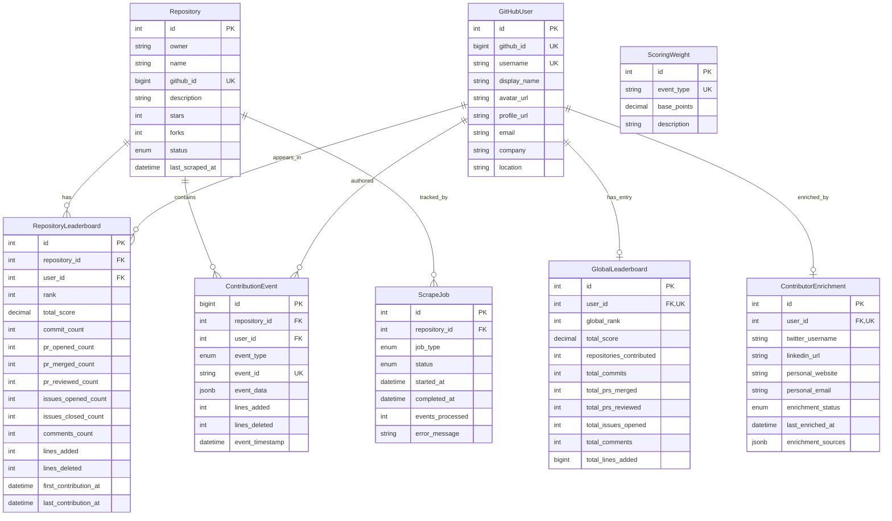

# GitHub Contributor Leaderboard - Complete System Architecture

## Table of Contents
1. [System Overview](#system-overview)
2. [Data Flow Pipeline](#data-flow-pipeline)
3. [Automated Task Pipeline](#automated-task-pipeline)
4. [Database Schema](#database-schema)
5. [API Endpoints](#api-endpoints)
6. [Scoring System](#scoring-system)

---

## System Overview


---

## Data Flow Pipeline

### Complete Scrape Pipeline


### Scoring Calculation Flow


---

## Automated Task Pipeline

### Scheduled Tasks


### Task Dependency Chain


### Retry & Error Handling


---

## Database Schema



---

## API Endpoints

### Complete Endpoint Map


---

## Scoring System

### Event Type Weights

| Event Type | Base Points | Description |
|------------|-------------|-------------|
| `RELEASE` | 30 | Publishing a release (highest single event) |
| `PR_MERGED` | 25 | Code successfully integrated |
| `PR_REVIEWED` | 20 | Code review contribution |
| `PR_OPENED` | 15 | Initiative to contribute |
| `COMMIT` | 10 | Direct code contribution |
| `ISSUE_OPENED` | 8 | Bug reports, feature requests |
| `ISSUE_CLOSED` | 5 | Resolution of issues |
| `PR_REVIEW_COMMENT` | 5 | Detailed review feedback |
| `COMMENT` | 3 | Discussion participation |
| `LINES_ADDED` | 0.01/line | Capped at 500 points total |
| `LINES_DELETED` | 0.005/line | Capped at 500 points total |

### Score Formula

```
total_score = (commits × 10)
            + (prs_opened × 15)
            + (prs_merged × 25)
            + (prs_reviewed × 20)
            + (issues_opened × 8)
            + (issues_closed × 5)
            + (comments × 3)
            + (releases × 30)
            + min(line_bonus, 500)

where line_bonus = (lines_added × 0.01) + (lines_deleted × 0.005)
```

---

## Technology Stack Summary

| Layer | Technology | Purpose |
|-------|------------|---------|
| **API** | FastAPI | Async REST API framework |
| **Database** | PostgreSQL 15+ | Primary data store |
| **ORM** | SQLAlchemy 2.0 | Async database access |
| **Queue** | Redis | Message broker + result backend |
| **Workers** | Celery | Background task processing |
| **Data Source** | BigQuery | GitHub Archive historical data |
| **Real-time** | WebSocket | Live log streaming |
| **HTTP Client** | httpx | Async HTTP requests |
| **Logging** | structlog | Structured logging |

---

## Deployment Architecture


---

## Quick Reference Commands

```bash
# Start infrastructure
docker run -d --name postgres-leaderboard -e POSTGRES_PASSWORD=postgres -e POSTGRES_DB=leaderboard -p 5433:5432 postgres:15-alpine
docker run -d --name redis-leaderboard -p 6379:6379 redis:7-alpine

# Start API server
uvicorn src.api.app:app --reload

# Start Celery worker (Windows)
celery -A src.workers.celery_app worker --loglevel=info --pool=solo

# Start Celery beat (scheduler)
celery -A src.workers.celery_app beat --loglevel=info

# Trigger a scrape
curl -X POST http://localhost:8000/api/v1/repositories/owner/name/scrape

# Recalculate scores
python scripts/recalculate_scores.py

# View dashboard
open http://localhost:8000/dashboard
```

---

## Advanced System Diagrams

### 1. Complete Request Lifecycle with Caching


---

### 2. Bot Filtering & User Deduplication Pipeline


---

### 3. Incremental vs Full Scrape Decision Matrix


---

### 4. Leaderboard Aggregation State Machine


---

### 5. Cost Tracking & Budget Enforcement Flow

```mermaid
flowchart TB
    subgraph Config["Budget Configuration"]
        DailyLimit["daily_limit_usd: $5.00"]
        MonthlyLimit["monthly_limit_usd: $50.00"]
        WarningPct["warning_threshold: 80%"]
        PricePerTB["price_per_tb: $5.00"]
    end

    subgraph PreJob["Pre-Job Validation"]
        EstimateBytes["Estimate bytes:\nrepo_size × date_range × factor"]
        EstimateCost["Estimate cost:\nbytes / 1TB × $5"]
        GetSpent["Get current spend:\nSUM(actual_cost) today/month"]
        CalcRemaining["remaining = limit - spent"]
    end

    subgraph Decision["Budget Decision"]
        CheckDaily{estimate ≤\ndaily_remaining?}
        CheckMonthly{estimate ≤\nmonthly_remaining?}
        CheckWarning{spent > 80%\nof limit?}
    end

    subgraph Actions["Actions"]
        Approve["✓ Approve job"]
        Reject["✗ Reject job\nBUDGET_EXCEEDED"]
        Warn["⚠ Log warning\nApproaching limit"]
        Alert["🔔 Send alert"]
    end

    subgraph PostJob["Post-Job Recording"]
        CaptureStats["Capture from BigQuery:\n- bytes_processed\n- bytes_billed\n- slot_millis"]
        CalcActual["actual_cost =\nbytes_billed / 1TB × $5"]
        CreateRecord["INSERT CostRecord"]
        UpdateSummary["UPDATE DailyCostSummary"]
        LogAudit["INSERT AuditLog"]
    end

    subgraph Monitoring["Dashboard Display"]
        DailyGauge["Daily: $X.XX / $5.00"]
        MonthlyGauge["Monthly: $XX.XX / $50.00"]
        CostHistory["Cost trend graph"]
        Forecast["Projected monthly cost"]
    end

    Config --> PreJob
    EstimateBytes --> EstimateCost
    EstimateCost --> GetSpent
    GetSpent --> CalcRemaining

    CalcRemaining --> CheckDaily
    CheckDaily -->|No| Reject
    CheckDaily -->|Yes| CheckMonthly
    CheckMonthly -->|No| Reject
    CheckMonthly -->|Yes| CheckWarning

    CheckWarning -->|Yes| Warn
    CheckWarning -->|No| Approve
    Warn --> Alert
    Alert --> Approve

    Approve --> CaptureStats
    CaptureStats --> CalcActual
    CalcActual --> CreateRecord
    CreateRecord --> UpdateSummary
    UpdateSummary --> LogAudit

    LogAudit --> DailyGauge
    DailyGauge --> MonthlyGauge
    MonthlyGauge --> CostHistory
    CostHistory --> Forecast

    classDef config fill:#87ceeb,stroke:#333
    classDef check fill:#ffd700,stroke:#333
    classDef approve fill:#98fb98,stroke:#333
    classDef reject fill:#ff6b6b,stroke:#333
    classDef warn fill:#ffcc00,stroke:#333

    class DailyLimit,MonthlyLimit,WarningPct,PricePerTB config
    class CheckDaily,CheckMonthly,CheckWarning check
    class Approve approve
    class Reject reject
    class Warn,Alert warn
```



---

### 6. Error Recovery & Circuit Breaker Pattern


---

### 7. Scheduled Pipeline Orchestration Detail

```mermaid
flowchart TB
    subgraph Trigger["Pipeline Triggers"]
        Cron["⏰ Cron: 0 2 * * *\n(2 AM UTC daily)"]
        Manual["👆 Manual Dispatch\n(GitHub Actions)"]
        Webhook["🔗 External Webhook"]
    end

    subgraph Preflight["Preflight Checks"]
        ValidateSecrets["Validate Secrets:\n- DATABASE_URL ✓\n- BIGQUERY_CREDENTIALS ✓\n- REDIS_URL ✓"]
        HealthCheck["Health Checks:\n- DB ping ✓\n- Redis ping ✓\n- BigQuery auth ✓"]
        BudgetCheck["Budget Check:\n- Daily remaining\n- Monthly remaining"]
    end

    subgraph Discovery["Stage 1: Discovery"]
        FindStale["Find stale repos:\nlast_scraped < 24h ago\nOR never scraped"]
        Prioritize["Prioritize by:\n1. Never scraped\n2. Most stale\n3. Highest stars"]
        SelectBatch["Select batch:\nmax 5 repos per run"]
    end

    subgraph Execution["Stage 2: Execution"]
        CreateJobs["Create ScrapeJobs\nfor each repo"]
        QueueTasks["Queue Celery tasks\n(parallel execution)"]
        MonitorProgress["Monitor progress:\n- Events processed\n- Errors encountered\n- Cost accumulated"]
    end

    subgraph Calculation["Stage 3: Calculation"]
        WaitComplete["Wait for all\njobs to complete"]
        RepoLeaderboards["Update repository\nleaderboards"]
        GlobalLeaderboard["Recalculate global\nleaderboard"]
    end

    subgraph Reporting["Stage 4: Reporting"]
        GenerateSummary["Generate summary:\n- Repos scraped: X\n- Users processed: Y\n- Cost: $Z.ZZ"]
        AuditLog["Log to audit:\nPIPELINE_COMPLETED"]
        UpdateMetrics["Update Prometheus\nmetrics"]
    end

    subgraph PostPipeline["Post-Pipeline"]
        Success{All stages\nsucceeded?}
        SuccessPath["✓ Exit 0\nLog success"]
        FailPath["✗ Exit 1\nCreate issue"]
        Cleanup["Cleanup:\n- Remove temp files\n- Clear credentials"]
    end

    Cron & Manual & Webhook --> ValidateSecrets
    ValidateSecrets -->|Invalid| Abort["❌ Abort"]
    ValidateSecrets -->|Valid| HealthCheck
    HealthCheck -->|Unhealthy| Abort
    HealthCheck -->|Healthy| BudgetCheck
    BudgetCheck -->|Exceeded| SkipExpensive["⚠ Skip scraping"]
    BudgetCheck -->|OK| FindStale

    FindStale --> Prioritize
    Prioritize --> SelectBatch
    SelectBatch --> CreateJobs
    CreateJobs --> QueueTasks
    QueueTasks --> MonitorProgress
    MonitorProgress --> WaitComplete

    SkipExpensive --> GlobalLeaderboard

    WaitComplete --> RepoLeaderboards
    RepoLeaderboards --> GlobalLeaderboard
    GlobalLeaderboard --> GenerateSummary
    GenerateSummary --> AuditLog
    AuditLog --> UpdateMetrics
    UpdateMetrics --> Success

    Success -->|Yes| SuccessPath
    Success -->|No| FailPath
    SuccessPath --> Cleanup
    FailPath --> Cleanup

    classDef trigger fill:#ffd700,stroke:#333
    classDef preflight fill:#87ceeb,stroke:#333
    classDef stage fill:#98fb98,stroke:#333
    classDef error fill:#ff6b6b,stroke:#333
    classDef success fill:#90ee90,stroke:#333

    class Cron,Manual,Webhook trigger
    class ValidateSecrets,HealthCheck,BudgetCheck preflight
    class FindStale,Prioritize,SelectBatch,CreateJobs,QueueTasks,MonitorProgress,WaitComplete,RepoLeaderboards,GlobalLeaderboard,GenerateSummary,AuditLog,UpdateMetrics stage
    class Abort,SkipExpensive,FailPath error
    class SuccessPath success
```



---

### 8. Data Consistency & Transaction Boundaries


---

### 9. WebSocket Real-Time Log Streaming


---

### 10. Complete Data Lifecycle


---

## Diagram Legend

| Symbol | Meaning |
|--------|---------|
| 🟢 Green | Success / Approved / Healthy |
| 🔴 Red | Error / Rejected / Failed |
| 🟡 Yellow | Warning / Decision Point |
| 🔵 Blue | Information / Configuration |
| 🟣 Purple | Tracking / Monitoring |
| ⬜ Gray | Maintenance / Background |

---

## Viewing Notes

These Mermaid diagrams render best in:
- **GitHub** - Native markdown preview
- **VS Code** - With Mermaid extension
- **Mermaid Live Editor** - https://mermaid.live
- **GitBook/Docusaurus** - Documentation platforms

For complex diagrams, zoom controls may be needed in some viewers.
