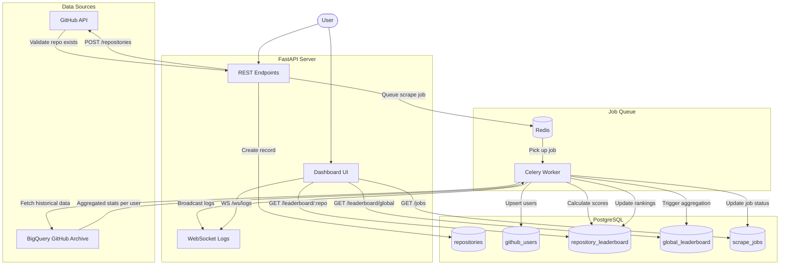
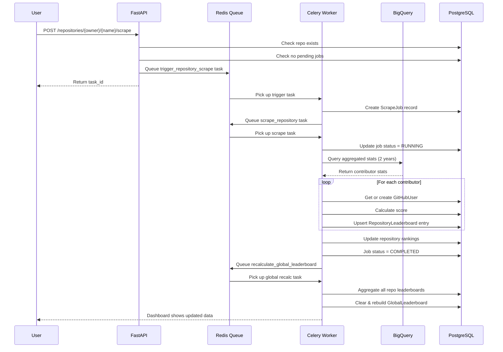
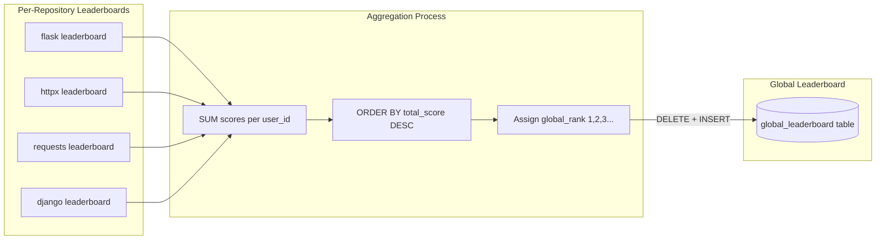

# GitHub Contributor Leaderboard Pipeline

## System Architecture

## Scrape Pipeline Detail

## Global Leaderboard Aggregation

## Scoring Formula

| Event Type | Points | Description |
|------------|--------|-------------|
| Commit | 10 | Direct code contribution |
| PR Opened | 15 | Initiative to contribute |
| PR Merged | 25 | Code successfully integrated |
| PR Reviewed | 20 | Code review contribution |
| Issue Opened | 8 | Bug reports, feature requests |
| Issue Closed | 5 | Resolution of issues |
| Comment | 3 | Discussion participation |
| Release | 30 | Major milestone |
| Lines Added | 0.01 | Minor bonus (capped) |
| Lines Deleted | 0.005 | Minor bonus (capped) |

**Line bonus capped at 1000 points max** to prevent large file additions from dominating scores.
